# K-NN in python: search for the best k

## 1- Load the required modeules


```python
import numpy as np                     # Llibreria matemàtica
import matplotlib.pyplot as plt        # Per mostrar plots
import sklearn                         # Llibreia de DM
import sklearn.datasets as ds            # Per carregar més facilment el dataset digits
import sklearn.model_selection as cv    # Pel Cross-validation
import sklearn.neighbors as nb           # Per fer servir el knn
%matplotlib inline                     
```

## 2- Load the data


```python
# Load digits dataset from scikit
digits = ds.load_digits()
# Separate data from labels
X = digits.data
y = digits.target
# Print range of values and dimensions of data
# Data and labels are numpy array, so we can use associated methods
print((X.min(), X.max()))
# Images are 8x8 pixels.
print(X.shape)
```

    (0.0, 16.0)
    (1797, 64)
    


```python
# Just for demostration purposes, let's see some images.
nrows, ncols = 2, 5
plt.figure(figsize=(6,3));
plt.gray()
for i in range(ncols * nrows):
    ax = plt.subplot(nrows, ncols, i + 1)
    ax.matshow(digits.images[i,...])
    plt.xticks([]); plt.yticks([]);
    plt.title(digits.target[i]);
plt.show()
```


    
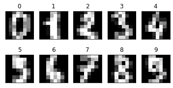
    


## 3- Simple cross-validation


```python
# Let's do a simple cross-validation: split data into training and test sets (test 30% of data)
(X_train, X_test,  y_train, y_test) = cv.train_test_split(X, y, test_size=.3, random_state=1)

# Create a kNN classifier object
knc = nb.KNeighborsClassifier()

# Train the classifier
knc.fit(X_train, y_train)

# Obtain accuracy score of learned classifier on test data
print(knc.score(X_test, y_test))


```

    0.9907407407407407
    


```python
# More information with confussion matrix
from sklearn.metrics import confusion_matrix

y_pred = knc.predict(X_test)
print(sklearn.metrics.confusion_matrix(y_test, y_pred))
```

    [[58  0  0  0  1  0  0  0  0  0]
     [ 0 49  0  0  0  0  0  0  0  0]
     [ 0  0 48  0  0  0  0  1  0  0]
     [ 0  0  0 64  0  0  0  0  0  0]
     [ 0  0  0  0 61  0  0  0  0  0]
     [ 0  0  0  0  0 46  0  0  0  1]
     [ 0  0  0  0  0  0 51  0  0  0]
     [ 0  0  0  0  0  0  0 57  0  0]
     [ 0  1  0  0  0  0  0  0 45  0]
     [ 0  0  0  0  0  1  0  0  0 56]]
    


```python
# Obtain Recall, Precision and F-Measure for each class
from sklearn import metrics

print(metrics.classification_report(y_test, y_pred))
```

                  precision    recall  f1-score   support
    
               0       1.00      0.98      0.99        59
               1       0.98      1.00      0.99        49
               2       1.00      0.98      0.99        49
               3       1.00      1.00      1.00        64
               4       0.98      1.00      0.99        61
               5       0.98      0.98      0.98        47
               6       1.00      1.00      1.00        51
               7       0.98      1.00      0.99        57
               8       1.00      0.98      0.99        46
               9       0.98      0.98      0.98        57
    
        accuracy                           0.99       540
       macro avg       0.99      0.99      0.99       540
    weighted avg       0.99      0.99      0.99       540
    
    

### Let's build a one by hand to see prediction


```python
one = np.zeros((8, 8))
one[1:-1, 4] = 16  # The image values are in [0, 16].
one[2, 3] = 16

# Draw the artifical image we just created
plt.figure(figsize=(2,2));
plt.imshow(one, interpolation='none');
plt.grid(False);
plt.xticks(); plt.yticks();
plt.title("One");
plt.show()
```


    
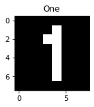
    


```python
# Let's see prediction for the new image
print(knc.predict(one.reshape(1, 64)))
```

    [1]
    

## 4- Let's do a 10-fold cross-validation


```python
# Method 1
from sklearn.model_selection import cross_val_score  
from sklearn.model_selection import cross_val_predict  
from sklearn.metrics import accuracy_score

cv_scores = cross_val_score(nb.KNeighborsClassifier(),  
                            X=X,  
                            y=y,  
                            cv=10, scoring='accuracy')  

# cv_scores is a list with 10 accuracies (one for each validation)
print(cv_scores)
```

    [0.92777778 0.98333333 0.97777778 0.95555556 0.97222222 0.97222222
     0.98888889 0.98324022 0.98324022 0.96648045]
    


```python
# Let's get the mean of the 10 validations (and standard deviation of them)
print(np.mean(cv_scores))
print(np.std(cv_scores))
```

    0.9710738671632526
    0.01716903805698193
    


```python
# Method 2
# Build confussion matrix of all 10 cross-validations
predicted = cross_val_predict(nb.KNeighborsClassifier(), X=X, y=y,  cv=10)  

print(sklearn.metrics.confusion_matrix(y, predicted))
print(sklearn.metrics.accuracy_score(y, predicted))
```

    [[178   0   0   0   0   0   0   0   0   0]
     [  0 181   0   0   0   0   1   0   0   0]
     [  0   3 170   0   0   0   0   1   3   0]
     [  0   0   1 175   0   1   0   2   2   2]
     [  0   1   0   0 178   0   0   2   0   0]
     [  0   0   0   0   0 177   1   0   0   4]
     [  0   1   0   0   0   1 179   0   0   0]
     [  0   0   0   0   0   0   0 176   0   3]
     [  0  10   1   1   0   0   0   1 161   0]
     [  0   2   0   4   1   1   0   1   1 170]]
    0.9710628825820813
    


```python
confmat = sklearn.metrics.confusion_matrix(y, predicted)

fig, ax = plt.subplots(figsize=(2.5, 2.5))
ax.matshow(confmat, cmap=plt.cm.Blues, alpha=0.3)
for i in range(confmat.shape[0]):
    for j in range(confmat.shape[1]):
        ax.text(x=j, y=i, s=confmat[i, j], va='center', ha='center',fontsize=7)

plt.xlabel('Predicted label')
plt.ylabel('True label')

plt.tight_layout()
plt.savefig('ConMatrix.png', dpi=600)
plt.show()
```


    
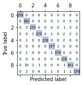
    


```python
print(metrics.classification_report(y_test, y_pred))
```

                  precision    recall  f1-score   support
    
               0       1.00      0.98      0.99        59
               1       0.98      1.00      0.99        49
               2       1.00      0.98      0.99        49
               3       1.00      1.00      1.00        64
               4       0.98      1.00      0.99        61
               5       0.98      0.98      0.98        47
               6       1.00      1.00      1.00        51
               7       0.98      1.00      0.99        57
               8       1.00      0.98      0.99        46
               9       0.98      0.98      0.98        57
    
        accuracy                           0.99       540
       macro avg       0.99      0.99      0.99       540
    weighted avg       0.99      0.99      0.99       540
    
    

### [Optional] Let's see how ammount of training data influences accuracy 


```python
import matplotlib.pyplot as plt
from sklearn.model_selection import learning_curve

train_sizes, train_scores, test_scores =\
                learning_curve(estimator=nb.KNeighborsClassifier(n_neighbors=3),
                               X=X,
                               y=y,
                               train_sizes=np.linspace(0.05, 1.0, 10),
                               cv=10,
                               n_jobs=-1)

train_mean = np.mean(train_scores, axis=1)
train_std = np.std(train_scores, axis=1)
test_mean = np.mean(test_scores, axis=1)
test_std = np.std(test_scores, axis=1)

plt.plot(train_sizes, train_mean,
         color='blue', marker='o',
         markersize=5, label='training accuracy')

plt.fill_between(train_sizes,
                 train_mean + train_std,
                 train_mean - train_std,
                 alpha=0.15, color='blue')

plt.plot(train_sizes, test_mean,
         color='green', linestyle='--',
         marker='s', markersize=5,
         label='validation accuracy')

plt.fill_between(train_sizes,
                 test_mean + test_std,
                 test_mean - test_std,
                 alpha=0.15, color='green')

plt.grid(True)
plt.xlabel('Number of training samples')
plt.ylabel('Accuracy')
plt.legend(loc='lower right')
plt.ylim([0.8, 1.03])
plt.tight_layout()
plt.savefig('learning_curve.png', dpi=600)
plt.show()
```


    
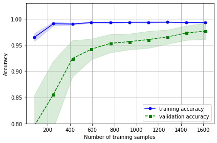
    


## 5- Finding parameters for k-NN


```python
# See parameters in
# http://scikit-learn.org/stable/modules/generated/sklearn.neighbors.KNeighborsClassifier.html

# Results with different parameters: k
cv_scores = cross_val_score(nb.KNeighborsClassifier(n_neighbors=1), X=X_train, y=y_train,  cv=10)  
print("Accuracy 1 neighbour:", np.mean(cv_scores))

cv_scores = cross_val_score(nb.KNeighborsClassifier(n_neighbors=3), X=X_train, y=y_train,  cv=10)  
print("Accuracy 3 neighbours:",  np.mean(cv_scores))

cv_scores = cross_val_score(nb.KNeighborsClassifier(n_neighbors=5), X=X_train, y=y_train,  cv=10)  
print("Accuracy 5 neighbours:",  np.mean(cv_scores))

cv_scores = cross_val_score(nb.KNeighborsClassifier(n_neighbors=7), X=X_train, y=y_train,  cv=10)  
print("Accuracy 7 neighbours:",  np.mean(cv_scores))

cv_scores = cross_val_score(nb.KNeighborsClassifier(n_neighbors=9), X=X_train, y=y_train,  cv=10)  
print("Accuracy 9 neighbours:",  np.mean(cv_scores))
```

    Accuracy 1 neighbour: 0.9818660509504591
    Accuracy 3 neighbours: 0.9842349001568083
    Accuracy 5 neighbours: 0.9802227923679562
    Accuracy 7 neighbours: 0.9777763860283523
    Accuracy 9 neighbours: 0.9754014852347016
    


```python
# Results with different parameters: k and distance weighting
cv_scores = cross_val_score(nb.KNeighborsClassifier(n_neighbors=1,weights='distance'), X=X_train, y=y_train,  cv=10)  
print("Accuracy 1 neighbour: and distance weighting:", np.mean(cv_scores))

cv_scores = cross_val_score(nb.KNeighborsClassifier(n_neighbors=3,weights='distance'), X=X_train, y=y_train,  cv=10)  
print("Accuracy 3 neighbour: and distance weighting:", np.mean(cv_scores))

cv_scores = cross_val_score(nb.KNeighborsClassifier(n_neighbors=5,weights='distance'), X=X_train, y=y_train,  cv=10)  
print("Accuracy 5 neighbour: and distance weighting:", np.mean(cv_scores))

cv_scores = cross_val_score(nb.KNeighborsClassifier(n_neighbors=7,weights='distance'), X=X_train, y=y_train,  cv=10)  
print("Accuracy 7 neighbour: and distance weighting:", np.mean(cv_scores))

cv_scores = cross_val_score(nb.KNeighborsClassifier(n_neighbors=9,weights='distance'), X=X_train, y=y_train,  cv=10)  
print("Accuracy 9 neighbour: and distance weighting:", np.mean(cv_scores))
```

    Accuracy 1 neighbour: and distance weighting: 0.9818660509504591
    Accuracy 3 neighbour: and distance weighting: 0.9842349001568083
    Accuracy 5 neighbour: and distance weighting: 0.9802227923679562
    Accuracy 7 neighbour: and distance weighting: 0.9777763860283523
    Accuracy 9 neighbour: and distance weighting: 0.9762014852347015
    

### Authomatically find best parameters:


```python
lr = []
for ki in range(1,30,2):
    cv_scores = cross_val_score(nb.KNeighborsClassifier(n_neighbors=ki), X=X_train, y=y_train, cv=10)
    lr.append(np.mean(cv_scores))
plt.plot(range(1,30,2),lr,'b',label='No weighting')

lr = []
for ki in range(1,30,2):
    cv_scores = cross_val_score(nb.KNeighborsClassifier(n_neighbors=ki,weights='distance'), X=X_train, y=y_train, cv=10)
    lr.append(np.mean(cv_scores))
plt.plot(range(1,30,2),lr,'r',label='Weighting')
plt.xlabel('k')
plt.ylabel('Accuracy')
plt.legend(loc='upper right')
plt.grid()
plt.tight_layout()

plt.show()
```


    
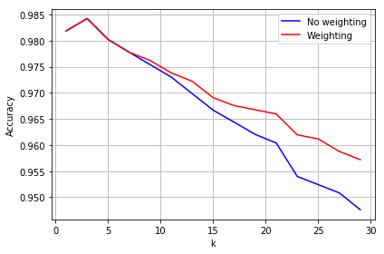
    


### Do the same using Grid Search method in python


```python
from sklearn.model_selection import GridSearchCV
params = {'n_neighbors':list(range(1,30,2)), 'weights':('distance','uniform')}
knc = nb.KNeighborsClassifier()
clf = GridSearchCV(knc, param_grid=params,cv=10,n_jobs=-1)  # If cv is integer, by default is Stratifyed 
clf.fit(X_train, y_train)
print("Best Params=",clf.best_params_, "Accuracy=", clf.best_score_)
```

    Best Params= {'n_neighbors': 3, 'weights': 'distance'} Accuracy= 0.9840891010342084
    

Apply models with best parameters found trained with all training data to the test set


```python
parval=clf.best_params_
knc = nb.KNeighborsClassifier(n_neighbors=parval['n_neighbors'],weights=parval['weights'])
knc.fit(X_train, y_train)
pred=knc.predict(X_test)
print(sklearn.metrics.confusion_matrix(y_test, pred))
print(sklearn.metrics.accuracy_score(y_test, pred))
```

    [[59  0  0  0  0  0  0  0  0  0]
     [ 0 49  0  0  0  0  0  0  0  0]
     [ 0  0 48  0  0  0  0  1  0  0]
     [ 0  0  0 64  0  0  0  0  0  0]
     [ 0  0  0  0 61  0  0  0  0  0]
     [ 0  0  0  0  0 46  0  0  0  1]
     [ 0  0  0  0  0  0 51  0  0  0]
     [ 0  0  0  0  0  0  0 56  0  1]
     [ 0  1  0  0  0  0  0  0 45  0]
     [ 0  0  0  0  0  1  0  0  0 56]]
    0.9907407407407407
    


```python
# interval confidence
from statsmodels.stats.proportion import proportion_confint

epsilon = sklearn.metrics.accuracy_score(y_test, pred)
print("Can approximate by Normal Distribution?: ",X_test.shape[0]*epsilon*(1-epsilon)>5)
print("Interval 95% confidence:", "{0:.3f}".format(epsilon), "+/-", "{0:.3f}".format(1.96*np.sqrt(epsilon*(1-epsilon)/X_test.shape[0])))
# or equivalent 
proportion_confint(count=epsilon*X_test.shape[0], nobs=X_test.shape[0], alpha=0.05, method='normal')
```

    Can approximate by Normal Distribution?:  False
    Interval 95% confidence: 0.991 +/- 0.008
    


    (0.9826624525124987, 0.9988190289689827)


```python
#Using Binomial distribution

proportion_confint(count=epsilon*X_test.shape[0], nobs=X_test.shape[0], alpha=0.05, method='binom_test')
```


    (0.9781611871249579, 0.9963446921115061)


### Mcnemar's Test implementation


```python
# Build two classifiers

# Classifier 1 (3 Neighbours) successes
y_pred = cross_val_predict(nb.KNeighborsClassifier(n_neighbors=3), X=X, y=y,  cv=10) 
res1=np.zeros(y.shape)
res1[y_pred==y]=1

# Classifier 2 (7 Neighbours) 2 successes
y_pred = cross_val_predict(nb.KNeighborsClassifier(n_neighbors=7), X=X, y=y,  cv=10) 
res2=np.zeros(y.shape)
res2[y_pred==y]=1

# Build contingency matrix
n00 = np.sum([res1[res2==1]==1])
n11 = np.sum([res1[res2==0]==0])
n10 = np.sum([res1[res2==1]==0])
n01 = np.sum([res1[res2==0]==1])

# Chi -square test
print("Have the classifiers significant different accuracy?:",(np.abs(n01-n10)-1)**2/(n01+n10)>3.84)
```

    Have the classifiers significant different accuracy?: True
    

### Take a look to the errors in test set


```python
testerrors=[i for i,k in enumerate(pred) if k!=y_test[i]]
plt.gray()
plt.ion
for i in testerrors:
    plt.matshow(X_test[i].reshape(8,8))
    plt.xticks([]); plt.yticks([]);
    print("Guess:", pred[i],"Reality:",y_test[i])
    plt.show()
```

    Guess: 9 Reality: 7
    


    <matplotlib.figure.Figure at 0x2577e3ae940>


    
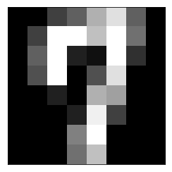
    


    Guess: 7 Reality: 2
    


    
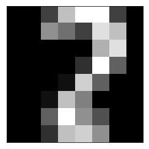
    


    Guess: 9 Reality: 5
    


    
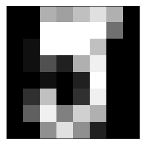
    


    Guess: 1 Reality: 8
    


    
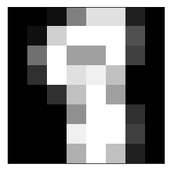
    


    Guess: 5 Reality: 9
    


    
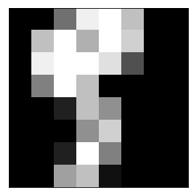
    


# Exercises:

### Do a 10-fold Cross-Validation using Naive Bayes


```python
from sklearn.naive_bayes import GaussianNB  # For numerical featuresm assuming normal distribution
from sklearn.naive_bayes import MultinomialNB  # For features with counting numbers (f.i. hown many times word appears in doc)
from sklearn.naive_bayes import BernoulliNB  # For binari features (f.i. word appears or not in document)

# No parameters to tune

clf = GaussianNB()
pred = clf.fit(X_train, y_train).predict(X_test)
print(sklearn.metrics.confusion_matrix(y_test, pred))
print()
print("Accuracy:", sklearn.metrics.accuracy_score(y_test, pred))
print()
print(metrics.classification_report(y_test, pred))
epsilon = sklearn.metrics.accuracy_score(y_test, pred)
proportion_confint(count=epsilon*X_test.shape[0], nobs=X_test.shape[0], alpha=0.05, method='binom_test')
```

    [[54  1  0  0  3  0  0  1  0  0]
     [ 0 42  1  0  0  0  0  0  6  0]
     [ 0  5 32  0  0  0  0  0 12  0]
     [ 0  2  2 51  0  1  0  3  5  0]
     [ 1  4  0  0 54  0  0  1  1  0]
     [ 0  2  0  1  0 41  0  2  1  0]
     [ 0  0  0  0  0  0 51  0  0  0]
     [ 0  0  0  0  0  0  0 57  0  0]
     [ 0 10  0  1  0  0  0  1 34  0]
     [ 0  2  0  1  2  3  1  7  8 33]]
    
    Accuracy: 0.831481481481
    
                 precision    recall  f1-score   support
    
              0       0.98      0.92      0.95        59
              1       0.62      0.86      0.72        49
              2       0.91      0.65      0.76        49
              3       0.94      0.80      0.86        64
              4       0.92      0.89      0.90        61
              5       0.91      0.87      0.89        47
              6       0.98      1.00      0.99        51
              7       0.79      1.00      0.88        57
              8       0.51      0.74      0.60        46
              9       1.00      0.58      0.73        57
    
    avg / total       0.87      0.83      0.83       540
    
    


    (0.7973917698694923, 0.861327901247561)


### Reproduce in Rapidminer


```python
# Export data to Rapidminer

import pandas as pd 
df = pd.DataFrame(np.c_[ digits.data, digits.target])
df.to_csv("digits2.csv",index=False)

# Go to Rapidminer and load the data set. Reproduce grid Search there and report results on the test set
```

### Play with noise


```python
# Lets' add noise to data: 64 new columns with random data
nrcols=64
col = np.random.randint(0,17,(X_train.data.shape[0],nrcols))
col
```


    array([[12, 12, 11, ...,  1, 12,  6],
           [12,  4, 14, ...,  7,  1,  6],
           [ 0,  3,  2, ...,  4, 10, 15],
           ..., 
           [ 4,  6,  2, ...,  9, 12,  1],
           [12,  9,  6, ..., 10,  3,  3],
           [ 8,  1,  8, ...,  0,  3,  7]])


```python
Xr=np.hstack((X_train,col))
Xr
```


    array([[  0.,   0.,   2., ...,   1.,  12.,   6.],
           [  0.,   0.,   3., ...,   7.,   1.,   6.],
           [  0.,   0.,   6., ...,   4.,  10.,  15.],
           ..., 
           [  0.,   0.,   7., ...,   9.,  12.,   1.],
           [  0.,   0.,   0., ...,  10.,   3.,   3.],
           [  0.,   0.,   8., ...,   0.,   3.,   7.]])


```python
col = np.random.randint(0,17,(X_test.data.shape[0],nrcols))
Xr_test=np.hstack((X_test,col))
```


```python
lr = []
for ki in range(1,30,2):
    knc = nb.KNeighborsClassifier(n_neighbors=ki)
    knc.fit(X_train, y_train)
    lr.append(knc.score(X_test, y_test))         
plt.plot(range(1,30,2),lr,'b',label='No noise')

lr = []
for ki in range(1,30,2):
    knc = nb.KNeighborsClassifier(n_neighbors=ki)
    knc.fit(Xr, y_train)
    lr.append(knc.score(Xr_test, y_test))  
plt.plot(range(1,30,2),lr,'r',label='With noise')

plt.xlabel('k')
plt.ylabel('Accuracy')
plt.legend(loc='upper right')
plt.grid()
plt.tight_layout()

plt.show()
```


    
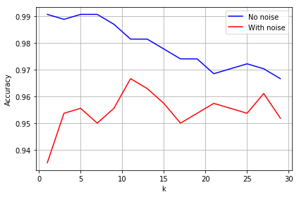
    


```python
from sklearn.feature_selection import SelectKBest
from sklearn.feature_selection import chi2, mutual_info_classif

fs = SelectKBest(mutual_info_classif, k=64).fit(Xr, y_train) #chi2
X_new = fs.transform(Xr)
Xtr_new = fs.transform(Xr_test)
```


```python
lr = []
for ki in range(1,30,2):
    knc = nb.KNeighborsClassifier(n_neighbors=ki)
    knc.fit(Xr, y_train)
    lr.append(knc.score(Xr_test, y_test))    
plt.plot(range(1,30,2),lr,'r',label='With noise')

lr = []
for ki in range(1,30,2):
    knc = nb.KNeighborsClassifier(n_neighbors=ki)
    knc.fit(X_train, y_train)
    lr.append(knc.score(X_test, y_test))   
plt.plot(range(1,30,2),lr,'b',label='No noise')

lr = []
for ki in range(1,30,2):
    knc = nb.KNeighborsClassifier(n_neighbors=ki)
    knc.fit(X_new, y_train)
    lr.append(knc.score(Xtr_new, y_test))   
plt.plot(range(1,30,2),lr,'g',label='Noise removed')

plt.xlabel('k')
plt.ylabel('Accuracy')
plt.legend(loc='upper right')
plt.grid()
plt.tight_layout()

plt.show()
```


    

    


### Change the scorer function


```python
#Let's try to optimize parameters for precision of class "9"

from sklearn.metrics import precision_score, recall_score, f1_score
from sklearn.metrics import make_scorer

params = {'n_neighbors':list(range(1,30,2)), 'weights':('distance','uniform')}
knc = nb.KNeighborsClassifier()
clf = GridSearchCV(knc, param_grid=params,cv=10,n_jobs=-1,scoring="accuracy") 
clf.fit(X_train, y_train)
print("Best Params=",clf.best_params_, "Accuracy=", clf.best_score_)

parval=clf.best_params_
knc = nb.KNeighborsClassifier(n_neighbors=parval['n_neighbors'],weights=parval['weights'])
knc.fit(X_train, y_train)
pred=knc.predict(X_test)
print(sklearn.metrics.confusion_matrix(y_test, pred))
print(sklearn.metrics.accuracy_score(y_test, pred))
print(metrics.classification_report(y_test, pred))

print('Precision for "9": %.3f' % precision_score(y_true=y_test, y_pred=pred,average='macro',labels=[9]))
```

    Best Params= {'n_neighbors': 3, 'weights': 'distance'} Accuracy= 0.984089101034
    [[59  0  0  0  0  0  0  0  0  0]
     [ 0 49  0  0  0  0  0  0  0  0]
     [ 0  0 48  0  0  0  0  1  0  0]
     [ 0  0  0 64  0  0  0  0  0  0]
     [ 0  0  0  0 61  0  0  0  0  0]
     [ 0  0  0  0  0 46  0  0  0  1]
     [ 0  0  0  0  0  0 51  0  0  0]
     [ 0  0  0  0  0  0  0 56  0  1]
     [ 0  1  0  0  0  0  0  0 45  0]
     [ 0  0  0  0  0  1  0  0  0 56]]
    0.990740740741
                 precision    recall  f1-score   support
    
              0       1.00      1.00      1.00        59
              1       0.98      1.00      0.99        49
              2       1.00      0.98      0.99        49
              3       1.00      1.00      1.00        64
              4       1.00      1.00      1.00        61
              5       0.98      0.98      0.98        47
              6       1.00      1.00      1.00        51
              7       0.98      0.98      0.98        57
              8       1.00      0.98      0.99        46
              9       0.97      0.98      0.97        57
    
    avg / total       0.99      0.99      0.99       540
    
    Precision for "9": 0.966
    


```python
# Precison of class 9 is low compared with others. 
# Assume precision of "9" is critical. Let's change optimize parameters by defining precision for 9.

scorer = make_scorer(precision_score,average='macro',labels=[9])
#scorer = make_scorer(score_func=precision_score, pos_label=9, greater_is_better=True,average='micro')


params = {'n_neighbors':list(range(1,30,2)), 'weights':('distance','uniform')}
knc = nb.KNeighborsClassifier()
clf = GridSearchCV(knc, param_grid=params,cv=10,n_jobs=-1,scoring=scorer) 
clf.fit(X_train, y_train)
print("Best Params=",clf.best_params_, "Precision=", clf.best_score_)

parval=clf.best_params_
knc = nb.KNeighborsClassifier(n_neighbors=parval['n_neighbors'],weights=parval['weights'])
knc.fit(X_train, y_train)
pred=knc.predict(X_test)
print(sklearn.metrics.confusion_matrix(y_test, pred))
print(sklearn.metrics.accuracy_score(y_test, pred))
print(metrics.classification_report(y_test, pred))

```

    Best Params= {'n_neighbors': 7, 'weights': 'distance'} Precision= 0.98507697553
    [[58  0  0  0  1  0  0  0  0  0]
     [ 0 49  0  0  0  0  0  0  0  0]
     [ 0  0 48  0  0  0  0  1  0  0]
     [ 0  0  0 64  0  0  0  0  0  0]
     [ 0  0  0  0 61  0  0  0  0  0]
     [ 0  0  0  0  0 46  0  0  0  1]
     [ 0  0  0  0  0  0 51  0  0  0]
     [ 0  0  0  0  0  0  0 57  0  0]
     [ 0  1  0  0  0  0  0  0 45  0]
     [ 0  0  0  0  0  1  0  0  0 56]]
    0.990740740741
                 precision    recall  f1-score   support
    
              0       1.00      0.98      0.99        59
              1       0.98      1.00      0.99        49
              2       1.00      0.98      0.99        49
              3       1.00      1.00      1.00        64
              4       0.98      1.00      0.99        61
              5       0.98      0.98      0.98        47
              6       1.00      1.00      1.00        51
              7       0.98      1.00      0.99        57
              8       1.00      0.98      0.99        46
              9       0.98      0.98      0.98        57
    
    avg / total       0.99      0.99      0.99       540
    
    


```python
testerrors=[i for i,k in enumerate(pred) if k!=y_test[i]]
plt.gray()
plt.ion
for i in testerrors:
    plt.matshow(X_test[i].reshape(8,8))
    plt.xticks([]); plt.yticks([]);
    print("Guess:", pred[i],"Reality:",y_test[i])
    plt.show()
```

    Guess: 4 Reality: 0
    


    <matplotlib.figure.Figure at 0x2577e43aef0>


    
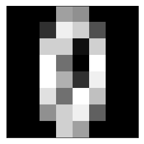
    


    Guess: 7 Reality: 2
    


    

    


    Guess: 9 Reality: 5
    


    

    


    Guess: 1 Reality: 8
    


    

    


    Guess: 5 Reality: 9
    


    

    


```python

```
