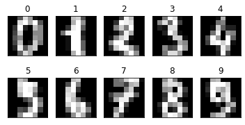
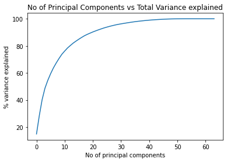
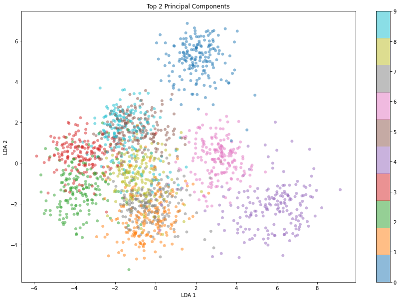
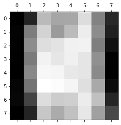

# PCA example


```python
import numpy as np
from sklearn.decomposition import PCA
from sklearn import decomposition
from sklearn import datasets
import matplotlib.pyplot as plt
  
```


```python
from sklearn.datasets import load_digits
# Load the digits data
digits = load_digits()
X = digits.data
y = digits.target
X[1]
```

    array([ 0.,  0.,  0., 12., 13.,  5.,  0.,  0.,  0.,  0.,  0., 11., 16.,
            9.,  0.,  0.,  0.,  0.,  3., 15., 16.,  6.,  0.,  0.,  0.,  7.,
           15., 16., 16.,  2.,  0.,  0.,  0.,  0.,  1., 16., 16.,  3.,  0.,
            0.,  0.,  0.,  1., 16., 16.,  6.,  0.,  0.,  0.,  0.,  1., 16.,
           16.,  6.,  0.,  0.,  0.,  0.,  0., 11., 16., 10.,  0.,  0.])


```python
# Just for demostration purposes, let's see some images.
nrows, ncols = 2, 5
plt.figure(figsize=(6,3))
plt.gray()
for i in range(ncols * nrows):
    ax = plt.subplot(nrows, ncols, i + 1)
    ax.matshow(digits.images[i,...])
    plt.xticks([])
    plt.yticks([])
    plt.title(digits.target[i])
plt.show()
```


    

    


```python
# Select only the first 2 principal components
pca = PCA(2)  # project from 64 to 2 dimensions
#Compute the first 2 PCA
projected = pca.fit_transform(digits.data)

# Plot a scatter plot of the first 2 principal components
plt.figure(figsize=(15, 10))
plt.scatter(projected[:, 0], projected[:, 1],
            c=digits.target, edgecolor='none', alpha=0.5,cmap='tab10')
plt.xlabel('PCA 1')
plt.ylabel('PCA 2')
plt.colorbar()
plt.title("Top 2 Principal Components")
#plt.savefig('fig1.png', bbox_inches='tight')

```


    Text(0.5, 1.0, 'Top 2 Principal Components')


    

    


```python
pca = PCA(64)  # project from 64 to 2 dimensions
projected = pca.fit_transform(digits.data)
varianceExp= pca.explained_variance_ratio_
# Compute the total sum of variance
totVarExp=np.cumsum(np.round(pca.explained_variance_ratio_, decimals=4)*100)

# Plot the variance explained as a function of the number of principal components
plt.plot(totVarExp)
plt.xlabel('No of principal components')
plt.ylabel('% variance explained')
plt.title('No of Principal Components vs Total Variance explained')
# plt.savefig('fig2.png', bbox_inches='tight')
```


    Text(0.5, 1.0, 'No of Principal Components vs Total Variance explained')


    

    


```python
# Select only the first 2 principal components
from sklearn.discriminant_analysis import LinearDiscriminantAnalysis
lda = LinearDiscriminantAnalysis(n_components=2)  # project from 64 to 2 dimensions
#Compute the first 2 PCA
projected = lda.fit_transform(digits.data,digits.target)

# Plot a scatter plot of the first 2 principal components
plt.figure(figsize=(15, 10))
plt.scatter(projected[:, 0], projected[:, 1],
            c=digits.target, edgecolor='none', alpha=0.5,cmap='tab10')
plt.xlabel('LDA 1')
plt.ylabel('LDA 2')
plt.colorbar()
plt.title("Top 2 Principal Components")
#plt.savefig('fig1.png', bbox_inches='tight')
```


    Text(0.5, 1.0, 'Top 2 Principal Components')


    

    


conda install ipyvolume


```python
import ipyvolume as ipv
from matplotlib import colors
import matplotlib

cmap = colors.ListedColormap(digits.target)
#[name for name, color in cmap.items()]
c = matplotlib.cm.tab10(np.linspace(0, 1, 10))
colors = [c[i] for i in digits.target]

fig = ipv.pylab.figure()
scater = ipv.scatter(projected[:, 0], projected[:, 1],projected[:, 2], color=colors, marker = 'sphere',edgecolor='none', alpha=0.5,cmap='tab10')
ipv.pylab.show()

```


    VBox(children=(Figure(camera=PerspectiveCamera(fov=46.0, position=(0.0, 0.0, 2.0), quaternion=(0.0, 0.0, 0.0, …


```python
from sklearn.manifold import TSNE
X_embedded = TSNE(n_components=2).fit_transform(digits.data)
plt.figure(figsize=(15, 10))
plt.scatter(X_embedded[:, 0], X_embedded[:, 1],
            c=digits.target, edgecolor='none', alpha=0.5,cmap='tab10')
```


    <matplotlib.collections.PathCollection at 0x26d5cf38700>


    

    


```python
X_embedded = TSNE(n_components=3).fit_transform(digits.data)
fig = ipv.pylab.figure()
scater = ipv.scatter(X_embedded[:, 0], X_embedded[:, 1],X_embedded[:, 2], color=colors, marker = 'sphere',edgecolor='none', alpha=0.5,cmap='tab10')
ipv.pylab.show()
```


    VBox(children=(Figure(camera=PerspectiveCamera(fov=46.0, position=(0.0, 0.0, 2.0), quaternion=(0.0, 0.0, 0.0, …


# Feature Selection


```python
variances = [X[:,p].std() for p in range(64)]
```


```python
image = np.reshape(variances,(8,8))
image
```


    array([[0.        , 0.90693964, 4.75350317, 4.24765948, 4.28619491,
            5.66484088, 3.32484969, 1.03709417],
           [0.09419533, 3.19527098, 5.41994694, 3.97643575, 4.78134964,
            6.05127561, 3.58532293, 0.82768465],
           [0.06235094, 3.57530605, 5.68918332, 5.80104695, 6.17400993,
            6.19559718, 3.25896254, 0.43847543],
           [0.03334258, 3.14565685, 6.19031469, 5.88129939, 6.15038083,
            5.87092136, 3.68543009, 0.04712725],
           [0.        , 3.4794038 , 6.32292731, 6.26664682, 5.93183902,
            5.86901393, 3.53629836, 0.        ],
           [0.14514503, 2.98098645, 6.53613529, 6.43958504, 6.25776954,
            5.69394162, 4.32974601, 0.30727036],
           [0.20416633, 1.74566694, 5.64292531, 5.22549314, 5.30057302,
            6.02947606, 4.91803706, 0.98412698],
           [0.02358333, 0.9340418 , 5.1015993 , 4.37347662, 4.93257433,
            5.89898069, 4.08940957, 1.85960409]])


```python
plt.matshow(image)

```


    <matplotlib.image.AxesImage at 0x243dd2ed280>


    

    


# Data transformation


```python
from sklearn import preprocessing
# Normalization and Scaling 
scaler = preprocessing.StandardScaler(with_mean=True, with_std=True).fit(X)
Xn=scaler.transform(X)
#Xtn=scaler.transform(X_test)      
Xn

```


    array([[ 0.        , -0.33501649, -0.04308102, ..., -1.14664746,
            -0.5056698 , -0.19600752],
           [ 0.        , -0.33501649, -1.09493684, ...,  0.54856067,
            -0.5056698 , -0.19600752],
           [ 0.        , -0.33501649, -1.09493684, ...,  1.56568555,
             1.6951369 , -0.19600752],
           ...,
           [ 0.        , -0.33501649, -0.88456568, ..., -0.12952258,
            -0.5056698 , -0.19600752],
           [ 0.        , -0.33501649, -0.67419451, ...,  0.8876023 ,
            -0.5056698 , -0.19600752],
           [ 0.        , -0.33501649,  1.00877481, ...,  0.8876023 ,
            -0.26113572, -0.19600752]])


```python
scaler2 = preprocessing.MinMaxScaler(feature_range=(0, 1)).fit(X)
Xn=scaler2.transform(X)      
#Xtn=scaler.transform(X_test) 
print(np.max(Xn))
print(np.min(Xn))
Xn

```

    1.0
    0.0
    


    array([[0.    , 0.    , 0.3125, ..., 0.    , 0.    , 0.    ],
           [0.    , 0.    , 0.    , ..., 0.625 , 0.    , 0.    ],
           [0.    , 0.    , 0.    , ..., 1.    , 0.5625, 0.    ],
           ...,
           [0.    , 0.    , 0.0625, ..., 0.375 , 0.    , 0.    ],
           [0.    , 0.    , 0.125 , ..., 0.75  , 0.    , 0.    ],
           [0.    , 0.    , 0.625 , ..., 0.75  , 0.0625, 0.    ]])


```python
# Si nomes volem una column,a no tot. i és index de columna
i=1
scalerP1 = preprocessing.MinMaxScaler(copy=False,feature_range=(0, 1)).fit(X[:,i].reshape(-1, 1))
scalerP1.transform(X[:,i].reshape(-1, 1))    
print(np.max(X[:,1]))
print(np.min(X[:,1]))
X

```

    1.0
    0.0
    


    array([[ 0.,  0.,  5., ...,  0.,  0.,  0.],
           [ 0.,  0.,  0., ..., 10.,  0.,  0.],
           [ 0.,  0.,  0., ..., 16.,  9.,  0.],
           ...,
           [ 0.,  0.,  1., ...,  6.,  0.,  0.],
           [ 0.,  0.,  2., ..., 12.,  0.,  0.],
           [ 0.,  0., 10., ..., 12.,  1.,  0.]])


```python
# Binarization: Numeric to boolean
binarizer = preprocessing.Binarizer(threshold=0.0).fit(X)
Xn = binarizer.transform(X)
Xn

```


    array([[0., 0., 1., ..., 0., 0., 0.],
           [0., 0., 0., ..., 1., 0., 0.],
           [0., 0., 0., ..., 1., 1., 0.],
           ...,
           [0., 0., 1., ..., 1., 0., 0.],
           [0., 0., 1., ..., 1., 0., 0.],
           [0., 0., 1., ..., 1., 1., 0.]])


# Encoding


```python
%matplotlib inline
import pandas
import matplotlib.pyplot as plt
from pandas import plotting
import numpy as np

URL = "https://archive.ics.uci.edu/ml/machine-learning-databases/adult/adult.data"
names=['Age', 'Workclass', 'fnlwgt', 'Education', 'Education-Num', 'Martial Status', 'Occupation', 'Relationship', "Race", "Sex", "Capital Gain", "Capital Loss", "Hours per week", "Country", 'Target']
df = pandas.read_csv(URL, sep=',', na_values=" ?",header=None,names=names)
df=df.drop(labels='fnlwgt',axis=1)
df.head(n=10)


```


<div>
<style scoped>
    .dataframe tbody tr th:only-of-type {
        vertical-align: middle;
    }

    .dataframe tbody tr th {
        vertical-align: top;
    }

    .dataframe thead th {
        text-align: right;
    }
</style>
<table border="1" class="dataframe">
  <thead>
    <tr style="text-align: right;">
      <th></th>
      <th>Age</th>
      <th>Workclass</th>
      <th>Education</th>
      <th>Education-Num</th>
      <th>Martial Status</th>
      <th>Occupation</th>
      <th>Relationship</th>
      <th>Race</th>
      <th>Sex</th>
      <th>Capital Gain</th>
      <th>Capital Loss</th>
      <th>Hours per week</th>
      <th>Country</th>
      <th>Target</th>
    </tr>
  </thead>
  <tbody>
    <tr>
      <th>0</th>
      <td>39</td>
      <td>State-gov</td>
      <td>Bachelors</td>
      <td>13</td>
      <td>Never-married</td>
      <td>Adm-clerical</td>
      <td>Not-in-family</td>
      <td>White</td>
      <td>Male</td>
      <td>2174</td>
      <td>0</td>
      <td>40</td>
      <td>United-States</td>
      <td>&lt;=50K</td>
    </tr>
    <tr>
      <th>1</th>
      <td>50</td>
      <td>Self-emp-not-inc</td>
      <td>Bachelors</td>
      <td>13</td>
      <td>Married-civ-spouse</td>
      <td>Exec-managerial</td>
      <td>Husband</td>
      <td>White</td>
      <td>Male</td>
      <td>0</td>
      <td>0</td>
      <td>13</td>
      <td>United-States</td>
      <td>&lt;=50K</td>
    </tr>
    <tr>
      <th>2</th>
      <td>38</td>
      <td>Private</td>
      <td>HS-grad</td>
      <td>9</td>
      <td>Divorced</td>
      <td>Handlers-cleaners</td>
      <td>Not-in-family</td>
      <td>White</td>
      <td>Male</td>
      <td>0</td>
      <td>0</td>
      <td>40</td>
      <td>United-States</td>
      <td>&lt;=50K</td>
    </tr>
    <tr>
      <th>3</th>
      <td>53</td>
      <td>Private</td>
      <td>11th</td>
      <td>7</td>
      <td>Married-civ-spouse</td>
      <td>Handlers-cleaners</td>
      <td>Husband</td>
      <td>Black</td>
      <td>Male</td>
      <td>0</td>
      <td>0</td>
      <td>40</td>
      <td>United-States</td>
      <td>&lt;=50K</td>
    </tr>
    <tr>
      <th>4</th>
      <td>28</td>
      <td>Private</td>
      <td>Bachelors</td>
      <td>13</td>
      <td>Married-civ-spouse</td>
      <td>Prof-specialty</td>
      <td>Wife</td>
      <td>Black</td>
      <td>Female</td>
      <td>0</td>
      <td>0</td>
      <td>40</td>
      <td>Cuba</td>
      <td>&lt;=50K</td>
    </tr>
    <tr>
      <th>5</th>
      <td>37</td>
      <td>Private</td>
      <td>Masters</td>
      <td>14</td>
      <td>Married-civ-spouse</td>
      <td>Exec-managerial</td>
      <td>Wife</td>
      <td>White</td>
      <td>Female</td>
      <td>0</td>
      <td>0</td>
      <td>40</td>
      <td>United-States</td>
      <td>&lt;=50K</td>
    </tr>
    <tr>
      <th>6</th>
      <td>49</td>
      <td>Private</td>
      <td>9th</td>
      <td>5</td>
      <td>Married-spouse-absent</td>
      <td>Other-service</td>
      <td>Not-in-family</td>
      <td>Black</td>
      <td>Female</td>
      <td>0</td>
      <td>0</td>
      <td>16</td>
      <td>Jamaica</td>
      <td>&lt;=50K</td>
    </tr>
    <tr>
      <th>7</th>
      <td>52</td>
      <td>Self-emp-not-inc</td>
      <td>HS-grad</td>
      <td>9</td>
      <td>Married-civ-spouse</td>
      <td>Exec-managerial</td>
      <td>Husband</td>
      <td>White</td>
      <td>Male</td>
      <td>0</td>
      <td>0</td>
      <td>45</td>
      <td>United-States</td>
      <td>&gt;50K</td>
    </tr>
    <tr>
      <th>8</th>
      <td>31</td>
      <td>Private</td>
      <td>Masters</td>
      <td>14</td>
      <td>Never-married</td>
      <td>Prof-specialty</td>
      <td>Not-in-family</td>
      <td>White</td>
      <td>Female</td>
      <td>14084</td>
      <td>0</td>
      <td>50</td>
      <td>United-States</td>
      <td>&gt;50K</td>
    </tr>
    <tr>
      <th>9</th>
      <td>42</td>
      <td>Private</td>
      <td>Bachelors</td>
      <td>13</td>
      <td>Married-civ-spouse</td>
      <td>Exec-managerial</td>
      <td>Husband</td>
      <td>White</td>
      <td>Male</td>
      <td>5178</td>
      <td>0</td>
      <td>40</td>
      <td>United-States</td>
      <td>&gt;50K</td>
    </tr>
  </tbody>
</table>
</div>


```python
pandas.get_dummies(df, drop_first=True).head()

```


<div>
<style scoped>
    .dataframe tbody tr th:only-of-type {
        vertical-align: middle;
    }

    .dataframe tbody tr th {
        vertical-align: top;
    }

    .dataframe thead th {
        text-align: right;
    }
</style>
<table border="1" class="dataframe">
  <thead>
    <tr style="text-align: right;">
      <th></th>
      <th>Age</th>
      <th>Education-Num</th>
      <th>Capital Gain</th>
      <th>Capital Loss</th>
      <th>Hours per week</th>
      <th>Workclass_ Local-gov</th>
      <th>Workclass_ Never-worked</th>
      <th>Workclass_ Private</th>
      <th>Workclass_ Self-emp-inc</th>
      <th>Workclass_ Self-emp-not-inc</th>
      <th>...</th>
      <th>Country_ Puerto-Rico</th>
      <th>Country_ Scotland</th>
      <th>Country_ South</th>
      <th>Country_ Taiwan</th>
      <th>Country_ Thailand</th>
      <th>Country_ Trinadad&amp;Tobago</th>
      <th>Country_ United-States</th>
      <th>Country_ Vietnam</th>
      <th>Country_ Yugoslavia</th>
      <th>Target_ &gt;50K</th>
    </tr>
  </thead>
  <tbody>
    <tr>
      <th>0</th>
      <td>39</td>
      <td>13</td>
      <td>2174</td>
      <td>0</td>
      <td>40</td>
      <td>0</td>
      <td>0</td>
      <td>0</td>
      <td>0</td>
      <td>0</td>
      <td>...</td>
      <td>0</td>
      <td>0</td>
      <td>0</td>
      <td>0</td>
      <td>0</td>
      <td>0</td>
      <td>1</td>
      <td>0</td>
      <td>0</td>
      <td>0</td>
    </tr>
    <tr>
      <th>1</th>
      <td>50</td>
      <td>13</td>
      <td>0</td>
      <td>0</td>
      <td>13</td>
      <td>0</td>
      <td>0</td>
      <td>0</td>
      <td>0</td>
      <td>1</td>
      <td>...</td>
      <td>0</td>
      <td>0</td>
      <td>0</td>
      <td>0</td>
      <td>0</td>
      <td>0</td>
      <td>1</td>
      <td>0</td>
      <td>0</td>
      <td>0</td>
    </tr>
    <tr>
      <th>2</th>
      <td>38</td>
      <td>9</td>
      <td>0</td>
      <td>0</td>
      <td>40</td>
      <td>0</td>
      <td>0</td>
      <td>1</td>
      <td>0</td>
      <td>0</td>
      <td>...</td>
      <td>0</td>
      <td>0</td>
      <td>0</td>
      <td>0</td>
      <td>0</td>
      <td>0</td>
      <td>1</td>
      <td>0</td>
      <td>0</td>
      <td>0</td>
    </tr>
    <tr>
      <th>3</th>
      <td>53</td>
      <td>7</td>
      <td>0</td>
      <td>0</td>
      <td>40</td>
      <td>0</td>
      <td>0</td>
      <td>1</td>
      <td>0</td>
      <td>0</td>
      <td>...</td>
      <td>0</td>
      <td>0</td>
      <td>0</td>
      <td>0</td>
      <td>0</td>
      <td>0</td>
      <td>1</td>
      <td>0</td>
      <td>0</td>
      <td>0</td>
    </tr>
    <tr>
      <th>4</th>
      <td>28</td>
      <td>13</td>
      <td>0</td>
      <td>0</td>
      <td>40</td>
      <td>0</td>
      <td>0</td>
      <td>1</td>
      <td>0</td>
      <td>0</td>
      <td>...</td>
      <td>0</td>
      <td>0</td>
      <td>0</td>
      <td>0</td>
      <td>0</td>
      <td>0</td>
      <td>0</td>
      <td>0</td>
      <td>0</td>
      <td>0</td>
    </tr>
  </tbody>
</table>
<p>5 rows × 97 columns</p>
</div>


```python
data = pandas.get_dummies(df)

X_embedded = TSNE(n_components=2).fit_transform(data)
plt.figure(figsize=(15, 10))
plt.scatter(X_embedded[:, 0], X_embedded[:, 1],
            c=digits.target, edgecolor='none', alpha=0.5,cmap='tab10')
```


# Importance of normalization


```python
import pandas as pd

df = pd.io.parsers.read_csv(
    'https://raw.githubusercontent.com/rasbt/pattern_classification/master/data/wine_data.csv',
    header=None,
    )
X_wine = df.values[:,1:]
y_wine = df.values[:,0]

df.head()
```


<div>
<style scoped>
    .dataframe tbody tr th:only-of-type {
        vertical-align: middle;
    }

    .dataframe tbody tr th {
        vertical-align: top;
    }

    .dataframe thead th {
        text-align: right;
    }
</style>
<table border="1" class="dataframe">
  <thead>
    <tr style="text-align: right;">
      <th></th>
      <th>0</th>
      <th>1</th>
      <th>2</th>
      <th>3</th>
      <th>4</th>
      <th>5</th>
      <th>6</th>
      <th>7</th>
      <th>8</th>
      <th>9</th>
      <th>10</th>
      <th>11</th>
      <th>12</th>
      <th>13</th>
    </tr>
  </thead>
  <tbody>
    <tr>
      <th>0</th>
      <td>1</td>
      <td>14.23</td>
      <td>1.71</td>
      <td>2.43</td>
      <td>15.6</td>
      <td>127</td>
      <td>2.80</td>
      <td>3.06</td>
      <td>0.28</td>
      <td>2.29</td>
      <td>5.64</td>
      <td>1.04</td>
      <td>3.92</td>
      <td>1065</td>
    </tr>
    <tr>
      <th>1</th>
      <td>1</td>
      <td>13.20</td>
      <td>1.78</td>
      <td>2.14</td>
      <td>11.2</td>
      <td>100</td>
      <td>2.65</td>
      <td>2.76</td>
      <td>0.26</td>
      <td>1.28</td>
      <td>4.38</td>
      <td>1.05</td>
      <td>3.40</td>
      <td>1050</td>
    </tr>
    <tr>
      <th>2</th>
      <td>1</td>
      <td>13.16</td>
      <td>2.36</td>
      <td>2.67</td>
      <td>18.6</td>
      <td>101</td>
      <td>2.80</td>
      <td>3.24</td>
      <td>0.30</td>
      <td>2.81</td>
      <td>5.68</td>
      <td>1.03</td>
      <td>3.17</td>
      <td>1185</td>
    </tr>
    <tr>
      <th>3</th>
      <td>1</td>
      <td>14.37</td>
      <td>1.95</td>
      <td>2.50</td>
      <td>16.8</td>
      <td>113</td>
      <td>3.85</td>
      <td>3.49</td>
      <td>0.24</td>
      <td>2.18</td>
      <td>7.80</td>
      <td>0.86</td>
      <td>3.45</td>
      <td>1480</td>
    </tr>
    <tr>
      <th>4</th>
      <td>1</td>
      <td>13.24</td>
      <td>2.59</td>
      <td>2.87</td>
      <td>21.0</td>
      <td>118</td>
      <td>2.80</td>
      <td>2.69</td>
      <td>0.39</td>
      <td>1.82</td>
      <td>4.32</td>
      <td>1.04</td>
      <td>2.93</td>
      <td>735</td>
    </tr>
  </tbody>
</table>
</div>


```python
from sklearn import preprocessing

std_scale = preprocessing.StandardScaler().fit(X_wine)
X_wine_std = std_scale.transform(X_wine)

# on data from 
pca = PCA(n_components=2).fit(X_wine)
X_train = pca.transform(X_wine)


# om standardized data
pca_std = PCA(n_components=2).fit(X_wine_std)
X_train_std = pca_std.transform(X_wine_std)


```


```python
from matplotlib import pyplot as plt

fig, (ax1, ax2) = plt.subplots(ncols=2, figsize=(10,4))


for l,c,m in zip(range(1,4), ('blue', 'red', 'green'), ('^', 's', 'o')):
    ax1.scatter(X_train[y_wine==l, 0], X_train[y_wine==l, 1],
        color=c,
        label='class %s' %l,
        alpha=0.5,
        marker=m
        )

for l,c,m in zip(range(1,4), ('blue', 'red', 'green'), ('^', 's', 'o')):
    ax2.scatter(X_train_std[y_wine==l, 0], X_train_std[y_wine==l, 1],
        color=c,
        label='class %s' %l,
        alpha=0.5,
        marker=m
        )

ax1.set_title('Transformed NON-standardized training dataset after PCA')    
ax2.set_title('Transformed standardized training dataset after PCA')    

for ax in (ax1, ax2):

    ax.set_xlabel('1st principal component')
    ax.set_ylabel('2nd principal component')
    ax.legend(loc='upper right')
    ax.grid()
plt.tight_layout()

plt.show()  
```


    

