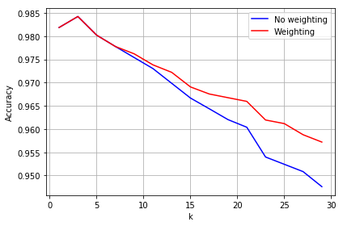
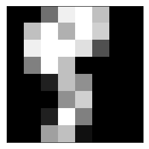
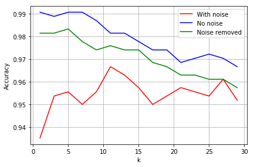
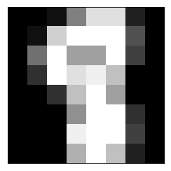

MINERÍA DE DATOS (DATA MINING)
================================
Assignatura MinerÍa de Datos de la UPC

# Info:
Per poder executar de manera correcta cadascuna de les sessions de laboratori, cal establir la carpeta de la sessió com 'source root' per poder llegir de manera correcta cadascuna de les dependencies.

# Laboratori
- [Sessió 1: PCA](#pca-example)
- [Sessió 2: KNN](#knn-in-python-search-for-the-best-k)

## PCA example


```python
import numpy as np
from sklearn.decomposition import PCA
from sklearn import decomposition
from sklearn import datasets
import matplotlib.pyplot as plt
  
```


```python
from sklearn.datasets import load_digits
# Load the digits data
digits = load_digits()
X = digits.data
y = digits.target
X[1]
```

    array([ 0.,  0.,  0., 12., 13.,  5.,  0.,  0.,  0.,  0.,  0., 11., 16.,
            9.,  0.,  0.,  0.,  0.,  3., 15., 16.,  6.,  0.,  0.,  0.,  7.,
           15., 16., 16.,  2.,  0.,  0.,  0.,  0.,  1., 16., 16.,  3.,  0.,
            0.,  0.,  0.,  1., 16., 16.,  6.,  0.,  0.,  0.,  0.,  1., 16.,
           16.,  6.,  0.,  0.,  0.,  0.,  0., 11., 16., 10.,  0.,  0.])


```python
# Just for demostration purposes, let's see some images.
nrows, ncols = 2, 5
plt.figure(figsize=(6,3))
plt.gray()
for i in range(ncols * nrows):
    ax = plt.subplot(nrows, ncols, i + 1)
    ax.matshow(digits.images[i,...])
    plt.xticks([])
    plt.yticks([])
    plt.title(digits.target[i])
plt.show()
```


    

    


```python
# Select only the first 2 principal components
pca = PCA(2)  # project from 64 to 2 dimensions
#Compute the first 2 PCA
projected = pca.fit_transform(digits.data)

# Plot a scatter plot of the first 2 principal components
plt.figure(figsize=(15, 10))
plt.scatter(projected[:, 0], projected[:, 1],
            c=digits.target, edgecolor='none', alpha=0.5,cmap='tab10')
plt.xlabel('PCA 1')
plt.ylabel('PCA 2')
plt.colorbar()
plt.title("Top 2 Principal Components")
#plt.savefig('fig1.png', bbox_inches='tight')

```


    Text(0.5, 1.0, 'Top 2 Principal Components')


    

    


```python
pca = PCA(64)  # project from 64 to 2 dimensions
projected = pca.fit_transform(digits.data)
varianceExp= pca.explained_variance_ratio_
# Compute the total sum of variance
totVarExp=np.cumsum(np.round(pca.explained_variance_ratio_, decimals=4)*100)

# Plot the variance explained as a function of the number of principal components
plt.plot(totVarExp)
plt.xlabel('No of principal components')
plt.ylabel('% variance explained')
plt.title('No of Principal Components vs Total Variance explained')
# plt.savefig('fig2.png', bbox_inches='tight')
```


    Text(0.5, 1.0, 'No of Principal Components vs Total Variance explained')


    

    


```python
# Select only the first 2 principal components
from sklearn.discriminant_analysis import LinearDiscriminantAnalysis
lda = LinearDiscriminantAnalysis(n_components=2)  # project from 64 to 2 dimensions
#Compute the first 2 PCA
projected = lda.fit_transform(digits.data,digits.target)

# Plot a scatter plot of the first 2 principal components
plt.figure(figsize=(15, 10))
plt.scatter(projected[:, 0], projected[:, 1],
            c=digits.target, edgecolor='none', alpha=0.5,cmap='tab10')
plt.xlabel('LDA 1')
plt.ylabel('LDA 2')
plt.colorbar()
plt.title("Top 2 Principal Components")
#plt.savefig('fig1.png', bbox_inches='tight')
```


    Text(0.5, 1.0, 'Top 2 Principal Components')


    

    


conda install ipyvolume


```python
import ipyvolume as ipv
from matplotlib import colors
import matplotlib

cmap = colors.ListedColormap(digits.target)
#[name for name, color in cmap.items()]
c = matplotlib.cm.tab10(np.linspace(0, 1, 10))
colors = [c[i] for i in digits.target]

fig = ipv.pylab.figure()
scater = ipv.scatter(projected[:, 0], projected[:, 1],projected[:, 2], color=colors, marker = 'sphere',edgecolor='none', alpha=0.5,cmap='tab10')
ipv.pylab.show()

```


    VBox(children=(Figure(camera=PerspectiveCamera(fov=46.0, position=(0.0, 0.0, 2.0), quaternion=(0.0, 0.0, 0.0, …


```python
from sklearn.manifold import TSNE
X_embedded = TSNE(n_components=2).fit_transform(digits.data)
plt.figure(figsize=(15, 10))
plt.scatter(X_embedded[:, 0], X_embedded[:, 1],
            c=digits.target, edgecolor='none', alpha=0.5,cmap='tab10')
```


    <matplotlib.collections.PathCollection at 0x26d5cf38700>


    

    


```python
X_embedded = TSNE(n_components=3).fit_transform(digits.data)
fig = ipv.pylab.figure()
scater = ipv.scatter(X_embedded[:, 0], X_embedded[:, 1],X_embedded[:, 2], color=colors, marker = 'sphere',edgecolor='none', alpha=0.5,cmap='tab10')
ipv.pylab.show()
```


    VBox(children=(Figure(camera=PerspectiveCamera(fov=46.0, position=(0.0, 0.0, 2.0), quaternion=(0.0, 0.0, 0.0, …


### Feature Selection


```python
variances = [X[:,p].std() for p in range(64)]
```


```python
image = np.reshape(variances,(8,8))
image
```


    array([[0.        , 0.90693964, 4.75350317, 4.24765948, 4.28619491,
            5.66484088, 3.32484969, 1.03709417],
           [0.09419533, 3.19527098, 5.41994694, 3.97643575, 4.78134964,
            6.05127561, 3.58532293, 0.82768465],
           [0.06235094, 3.57530605, 5.68918332, 5.80104695, 6.17400993,
            6.19559718, 3.25896254, 0.43847543],
           [0.03334258, 3.14565685, 6.19031469, 5.88129939, 6.15038083,
            5.87092136, 3.68543009, 0.04712725],
           [0.        , 3.4794038 , 6.32292731, 6.26664682, 5.93183902,
            5.86901393, 3.53629836, 0.        ],
           [0.14514503, 2.98098645, 6.53613529, 6.43958504, 6.25776954,
            5.69394162, 4.32974601, 0.30727036],
           [0.20416633, 1.74566694, 5.64292531, 5.22549314, 5.30057302,
            6.02947606, 4.91803706, 0.98412698],
           [0.02358333, 0.9340418 , 5.1015993 , 4.37347662, 4.93257433,
            5.89898069, 4.08940957, 1.85960409]])


```python
plt.matshow(image)

```


    <matplotlib.image.AxesImage at 0x243dd2ed280>


    

    


### Data transformation


```python
from sklearn import preprocessing
# Normalization and Scaling 
scaler = preprocessing.StandardScaler(with_mean=True, with_std=True).fit(X)
Xn=scaler.transform(X)
#Xtn=scaler.transform(X_test)      
Xn

```


    array([[ 0.        , -0.33501649, -0.04308102, ..., -1.14664746,
            -0.5056698 , -0.19600752],
           [ 0.        , -0.33501649, -1.09493684, ...,  0.54856067,
            -0.5056698 , -0.19600752],
           [ 0.        , -0.33501649, -1.09493684, ...,  1.56568555,
             1.6951369 , -0.19600752],
           ...,
           [ 0.        , -0.33501649, -0.88456568, ..., -0.12952258,
            -0.5056698 , -0.19600752],
           [ 0.        , -0.33501649, -0.67419451, ...,  0.8876023 ,
            -0.5056698 , -0.19600752],
           [ 0.        , -0.33501649,  1.00877481, ...,  0.8876023 ,
            -0.26113572, -0.19600752]])


```python
scaler2 = preprocessing.MinMaxScaler(feature_range=(0, 1)).fit(X)
Xn=scaler2.transform(X)      
#Xtn=scaler.transform(X_test) 
print(np.max(Xn))
print(np.min(Xn))
Xn

```

    1.0
    0.0
    


    array([[0.    , 0.    , 0.3125, ..., 0.    , 0.    , 0.    ],
           [0.    , 0.    , 0.    , ..., 0.625 , 0.    , 0.    ],
           [0.    , 0.    , 0.    , ..., 1.    , 0.5625, 0.    ],
           ...,
           [0.    , 0.    , 0.0625, ..., 0.375 , 0.    , 0.    ],
           [0.    , 0.    , 0.125 , ..., 0.75  , 0.    , 0.    ],
           [0.    , 0.    , 0.625 , ..., 0.75  , 0.0625, 0.    ]])


```python
# Si nomes volem una column,a no tot. i és index de columna
i=1
scalerP1 = preprocessing.MinMaxScaler(copy=False,feature_range=(0, 1)).fit(X[:,i].reshape(-1, 1))
scalerP1.transform(X[:,i].reshape(-1, 1))    
print(np.max(X[:,1]))
print(np.min(X[:,1]))
X

```

    1.0
    0.0
    


    array([[ 0.,  0.,  5., ...,  0.,  0.,  0.],
           [ 0.,  0.,  0., ..., 10.,  0.,  0.],
           [ 0.,  0.,  0., ..., 16.,  9.,  0.],
           ...,
           [ 0.,  0.,  1., ...,  6.,  0.,  0.],
           [ 0.,  0.,  2., ..., 12.,  0.,  0.],
           [ 0.,  0., 10., ..., 12.,  1.,  0.]])


```python
# Binarization: Numeric to boolean
binarizer = preprocessing.Binarizer(threshold=0.0).fit(X)
Xn = binarizer.transform(X)
Xn

```


    array([[0., 0., 1., ..., 0., 0., 0.],
           [0., 0., 0., ..., 1., 0., 0.],
           [0., 0., 0., ..., 1., 1., 0.],
           ...,
           [0., 0., 1., ..., 1., 0., 0.],
           [0., 0., 1., ..., 1., 0., 0.],
           [0., 0., 1., ..., 1., 1., 0.]])


### Encoding


```python
%matplotlib inline
import pandas
import matplotlib.pyplot as plt
from pandas import plotting
import numpy as np

URL = "https://archive.ics.uci.edu/ml/machine-learning-databases/adult/adult.data"
names=['Age', 'Workclass', 'fnlwgt', 'Education', 'Education-Num', 'Martial Status', 'Occupation', 'Relationship', "Race", "Sex", "Capital Gain", "Capital Loss", "Hours per week", "Country", 'Target']
df = pandas.read_csv(URL, sep=',', na_values=" ?",header=None,names=names)
df=df.drop(labels='fnlwgt',axis=1)
df.head(n=10)


```


<div>
<style scoped>
    .dataframe tbody tr th:only-of-type {
        vertical-align: middle;
    }

    .dataframe tbody tr th {
        vertical-align: top;
    }

    .dataframe thead th {
        text-align: right;
    }
</style>
<table border="1" class="dataframe">
  <thead>
    <tr style="text-align: right;">
      <th></th>
      <th>Age</th>
      <th>Workclass</th>
      <th>Education</th>
      <th>Education-Num</th>
      <th>Martial Status</th>
      <th>Occupation</th>
      <th>Relationship</th>
      <th>Race</th>
      <th>Sex</th>
      <th>Capital Gain</th>
      <th>Capital Loss</th>
      <th>Hours per week</th>
      <th>Country</th>
      <th>Target</th>
    </tr>
  </thead>
  <tbody>
    <tr>
      <th>0</th>
      <td>39</td>
      <td>State-gov</td>
      <td>Bachelors</td>
      <td>13</td>
      <td>Never-married</td>
      <td>Adm-clerical</td>
      <td>Not-in-family</td>
      <td>White</td>
      <td>Male</td>
      <td>2174</td>
      <td>0</td>
      <td>40</td>
      <td>United-States</td>
      <td>&lt;=50K</td>
    </tr>
    <tr>
      <th>1</th>
      <td>50</td>
      <td>Self-emp-not-inc</td>
      <td>Bachelors</td>
      <td>13</td>
      <td>Married-civ-spouse</td>
      <td>Exec-managerial</td>
      <td>Husband</td>
      <td>White</td>
      <td>Male</td>
      <td>0</td>
      <td>0</td>
      <td>13</td>
      <td>United-States</td>
      <td>&lt;=50K</td>
    </tr>
    <tr>
      <th>2</th>
      <td>38</td>
      <td>Private</td>
      <td>HS-grad</td>
      <td>9</td>
      <td>Divorced</td>
      <td>Handlers-cleaners</td>
      <td>Not-in-family</td>
      <td>White</td>
      <td>Male</td>
      <td>0</td>
      <td>0</td>
      <td>40</td>
      <td>United-States</td>
      <td>&lt;=50K</td>
    </tr>
    <tr>
      <th>3</th>
      <td>53</td>
      <td>Private</td>
      <td>11th</td>
      <td>7</td>
      <td>Married-civ-spouse</td>
      <td>Handlers-cleaners</td>
      <td>Husband</td>
      <td>Black</td>
      <td>Male</td>
      <td>0</td>
      <td>0</td>
      <td>40</td>
      <td>United-States</td>
      <td>&lt;=50K</td>
    </tr>
    <tr>
      <th>4</th>
      <td>28</td>
      <td>Private</td>
      <td>Bachelors</td>
      <td>13</td>
      <td>Married-civ-spouse</td>
      <td>Prof-specialty</td>
      <td>Wife</td>
      <td>Black</td>
      <td>Female</td>
      <td>0</td>
      <td>0</td>
      <td>40</td>
      <td>Cuba</td>
      <td>&lt;=50K</td>
    </tr>
    <tr>
      <th>5</th>
      <td>37</td>
      <td>Private</td>
      <td>Masters</td>
      <td>14</td>
      <td>Married-civ-spouse</td>
      <td>Exec-managerial</td>
      <td>Wife</td>
      <td>White</td>
      <td>Female</td>
      <td>0</td>
      <td>0</td>
      <td>40</td>
      <td>United-States</td>
      <td>&lt;=50K</td>
    </tr>
    <tr>
      <th>6</th>
      <td>49</td>
      <td>Private</td>
      <td>9th</td>
      <td>5</td>
      <td>Married-spouse-absent</td>
      <td>Other-service</td>
      <td>Not-in-family</td>
      <td>Black</td>
      <td>Female</td>
      <td>0</td>
      <td>0</td>
      <td>16</td>
      <td>Jamaica</td>
      <td>&lt;=50K</td>
    </tr>
    <tr>
      <th>7</th>
      <td>52</td>
      <td>Self-emp-not-inc</td>
      <td>HS-grad</td>
      <td>9</td>
      <td>Married-civ-spouse</td>
      <td>Exec-managerial</td>
      <td>Husband</td>
      <td>White</td>
      <td>Male</td>
      <td>0</td>
      <td>0</td>
      <td>45</td>
      <td>United-States</td>
      <td>&gt;50K</td>
    </tr>
    <tr>
      <th>8</th>
      <td>31</td>
      <td>Private</td>
      <td>Masters</td>
      <td>14</td>
      <td>Never-married</td>
      <td>Prof-specialty</td>
      <td>Not-in-family</td>
      <td>White</td>
      <td>Female</td>
      <td>14084</td>
      <td>0</td>
      <td>50</td>
      <td>United-States</td>
      <td>&gt;50K</td>
    </tr>
    <tr>
      <th>9</th>
      <td>42</td>
      <td>Private</td>
      <td>Bachelors</td>
      <td>13</td>
      <td>Married-civ-spouse</td>
      <td>Exec-managerial</td>
      <td>Husband</td>
      <td>White</td>
      <td>Male</td>
      <td>5178</td>
      <td>0</td>
      <td>40</td>
      <td>United-States</td>
      <td>&gt;50K</td>
    </tr>
  </tbody>
</table>
</div>


```python
pandas.get_dummies(df, drop_first=True).head()

```


<div>
<style scoped>
    .dataframe tbody tr th:only-of-type {
        vertical-align: middle;
    }

    .dataframe tbody tr th {
        vertical-align: top;
    }

    .dataframe thead th {
        text-align: right;
    }
</style>
<table border="1" class="dataframe">
  <thead>
    <tr style="text-align: right;">
      <th></th>
      <th>Age</th>
      <th>Education-Num</th>
      <th>Capital Gain</th>
      <th>Capital Loss</th>
      <th>Hours per week</th>
      <th>Workclass_ Local-gov</th>
      <th>Workclass_ Never-worked</th>
      <th>Workclass_ Private</th>
      <th>Workclass_ Self-emp-inc</th>
      <th>Workclass_ Self-emp-not-inc</th>
      <th>...</th>
      <th>Country_ Puerto-Rico</th>
      <th>Country_ Scotland</th>
      <th>Country_ South</th>
      <th>Country_ Taiwan</th>
      <th>Country_ Thailand</th>
      <th>Country_ Trinadad&amp;Tobago</th>
      <th>Country_ United-States</th>
      <th>Country_ Vietnam</th>
      <th>Country_ Yugoslavia</th>
      <th>Target_ &gt;50K</th>
    </tr>
  </thead>
  <tbody>
    <tr>
      <th>0</th>
      <td>39</td>
      <td>13</td>
      <td>2174</td>
      <td>0</td>
      <td>40</td>
      <td>0</td>
      <td>0</td>
      <td>0</td>
      <td>0</td>
      <td>0</td>
      <td>...</td>
      <td>0</td>
      <td>0</td>
      <td>0</td>
      <td>0</td>
      <td>0</td>
      <td>0</td>
      <td>1</td>
      <td>0</td>
      <td>0</td>
      <td>0</td>
    </tr>
    <tr>
      <th>1</th>
      <td>50</td>
      <td>13</td>
      <td>0</td>
      <td>0</td>
      <td>13</td>
      <td>0</td>
      <td>0</td>
      <td>0</td>
      <td>0</td>
      <td>1</td>
      <td>...</td>
      <td>0</td>
      <td>0</td>
      <td>0</td>
      <td>0</td>
      <td>0</td>
      <td>0</td>
      <td>1</td>
      <td>0</td>
      <td>0</td>
      <td>0</td>
    </tr>
    <tr>
      <th>2</th>
      <td>38</td>
      <td>9</td>
      <td>0</td>
      <td>0</td>
      <td>40</td>
      <td>0</td>
      <td>0</td>
      <td>1</td>
      <td>0</td>
      <td>0</td>
      <td>...</td>
      <td>0</td>
      <td>0</td>
      <td>0</td>
      <td>0</td>
      <td>0</td>
      <td>0</td>
      <td>1</td>
      <td>0</td>
      <td>0</td>
      <td>0</td>
    </tr>
    <tr>
      <th>3</th>
      <td>53</td>
      <td>7</td>
      <td>0</td>
      <td>0</td>
      <td>40</td>
      <td>0</td>
      <td>0</td>
      <td>1</td>
      <td>0</td>
      <td>0</td>
      <td>...</td>
      <td>0</td>
      <td>0</td>
      <td>0</td>
      <td>0</td>
      <td>0</td>
      <td>0</td>
      <td>1</td>
      <td>0</td>
      <td>0</td>
      <td>0</td>
    </tr>
    <tr>
      <th>4</th>
      <td>28</td>
      <td>13</td>
      <td>0</td>
      <td>0</td>
      <td>40</td>
      <td>0</td>
      <td>0</td>
      <td>1</td>
      <td>0</td>
      <td>0</td>
      <td>...</td>
      <td>0</td>
      <td>0</td>
      <td>0</td>
      <td>0</td>
      <td>0</td>
      <td>0</td>
      <td>0</td>
      <td>0</td>
      <td>0</td>
      <td>0</td>
    </tr>
  </tbody>
</table>
<p>5 rows × 97 columns</p>
</div>


```python
data = pandas.get_dummies(df)

X_embedded = TSNE(n_components=2).fit_transform(data)
plt.figure(figsize=(15, 10))
plt.scatter(X_embedded[:, 0], X_embedded[:, 1],
            c=digits.target, edgecolor='none', alpha=0.5,cmap='tab10')
```


### Importance of normalization


```python
import pandas as pd

df = pd.io.parsers.read_csv(
    'https://raw.githubusercontent.com/rasbt/pattern_classification/master/data/wine_data.csv',
    header=None,
    )
X_wine = df.values[:,1:]
y_wine = df.values[:,0]

df.head()
```


<div>
<style scoped>
    .dataframe tbody tr th:only-of-type {
        vertical-align: middle;
    }

    .dataframe tbody tr th {
        vertical-align: top;
    }

    .dataframe thead th {
        text-align: right;
    }
</style>
<table border="1" class="dataframe">
  <thead>
    <tr style="text-align: right;">
      <th></th>
      <th>0</th>
      <th>1</th>
      <th>2</th>
      <th>3</th>
      <th>4</th>
      <th>5</th>
      <th>6</th>
      <th>7</th>
      <th>8</th>
      <th>9</th>
      <th>10</th>
      <th>11</th>
      <th>12</th>
      <th>13</th>
    </tr>
  </thead>
  <tbody>
    <tr>
      <th>0</th>
      <td>1</td>
      <td>14.23</td>
      <td>1.71</td>
      <td>2.43</td>
      <td>15.6</td>
      <td>127</td>
      <td>2.80</td>
      <td>3.06</td>
      <td>0.28</td>
      <td>2.29</td>
      <td>5.64</td>
      <td>1.04</td>
      <td>3.92</td>
      <td>1065</td>
    </tr>
    <tr>
      <th>1</th>
      <td>1</td>
      <td>13.20</td>
      <td>1.78</td>
      <td>2.14</td>
      <td>11.2</td>
      <td>100</td>
      <td>2.65</td>
      <td>2.76</td>
      <td>0.26</td>
      <td>1.28</td>
      <td>4.38</td>
      <td>1.05</td>
      <td>3.40</td>
      <td>1050</td>
    </tr>
    <tr>
      <th>2</th>
      <td>1</td>
      <td>13.16</td>
      <td>2.36</td>
      <td>2.67</td>
      <td>18.6</td>
      <td>101</td>
      <td>2.80</td>
      <td>3.24</td>
      <td>0.30</td>
      <td>2.81</td>
      <td>5.68</td>
      <td>1.03</td>
      <td>3.17</td>
      <td>1185</td>
    </tr>
    <tr>
      <th>3</th>
      <td>1</td>
      <td>14.37</td>
      <td>1.95</td>
      <td>2.50</td>
      <td>16.8</td>
      <td>113</td>
      <td>3.85</td>
      <td>3.49</td>
      <td>0.24</td>
      <td>2.18</td>
      <td>7.80</td>
      <td>0.86</td>
      <td>3.45</td>
      <td>1480</td>
    </tr>
    <tr>
      <th>4</th>
      <td>1</td>
      <td>13.24</td>
      <td>2.59</td>
      <td>2.87</td>
      <td>21.0</td>
      <td>118</td>
      <td>2.80</td>
      <td>2.69</td>
      <td>0.39</td>
      <td>1.82</td>
      <td>4.32</td>
      <td>1.04</td>
      <td>2.93</td>
      <td>735</td>
    </tr>
  </tbody>
</table>
</div>


```python
from sklearn import preprocessing

std_scale = preprocessing.StandardScaler().fit(X_wine)
X_wine_std = std_scale.transform(X_wine)

# on data from 
pca = PCA(n_components=2).fit(X_wine)
X_train = pca.transform(X_wine)


# om standardized data
pca_std = PCA(n_components=2).fit(X_wine_std)
X_train_std = pca_std.transform(X_wine_std)


```


```python
from matplotlib import pyplot as plt

fig, (ax1, ax2) = plt.subplots(ncols=2, figsize=(10,4))


for l,c,m in zip(range(1,4), ('blue', 'red', 'green'), ('^', 's', 'o')):
    ax1.scatter(X_train[y_wine==l, 0], X_train[y_wine==l, 1],
        color=c,
        label='class %s' %l,
        alpha=0.5,
        marker=m
        )

for l,c,m in zip(range(1,4), ('blue', 'red', 'green'), ('^', 's', 'o')):
    ax2.scatter(X_train_std[y_wine==l, 0], X_train_std[y_wine==l, 1],
        color=c,
        label='class %s' %l,
        alpha=0.5,
        marker=m
        )

ax1.set_title('Transformed NON-standardized training dataset after PCA')    
ax2.set_title('Transformed standardized training dataset after PCA')    

for ax in (ax1, ax2):

    ax.set_xlabel('1st principal component')
    ax.set_ylabel('2nd principal component')
    ax.legend(loc='upper right')
    ax.grid()
plt.tight_layout()

plt.show()  
```


    


---------------------------------------------
---------------------------------------------


## KNN in python: search for the best k

### 1- Load the required modeules


```python
import numpy as np                     # Llibreria matemàtica
import matplotlib.pyplot as plt        # Per mostrar plots
import sklearn                         # Llibreia de DM
import sklearn.datasets as ds            # Per carregar més facilment el dataset digits
import sklearn.model_selection as cv    # Pel Cross-validation
import sklearn.neighbors as nb           # Per fer servir el knn
%matplotlib inline                     
```

### 2- Load the data


```python
# Load digits dataset from scikit
digits = ds.load_digits()
# Separate data from labels
X = digits.data
y = digits.target
# Print range of values and dimensions of data
# Data and labels are numpy array, so we can use associated methods
print((X.min(), X.max()))
# Images are 8x8 pixels.
print(X.shape)
```

    (0.0, 16.0)
    (1797, 64)
    


```python
# Just for demostration purposes, let's see some images.
nrows, ncols = 2, 5
plt.figure(figsize=(6,3));
plt.gray()
for i in range(ncols * nrows):
    ax = plt.subplot(nrows, ncols, i + 1)
    ax.matshow(digits.images[i,...])
    plt.xticks([]); plt.yticks([]);
    plt.title(digits.target[i]);
plt.show()
```


    

    


### 3- Simple cross-validation


```python
# Let's do a simple cross-validation: split data into training and test sets (test 30% of data)
(X_train, X_test,  y_train, y_test) = cv.train_test_split(X, y, test_size=.3, random_state=1)

# Create a kNN classifier object
knc = nb.KNeighborsClassifier()

# Train the classifier
knc.fit(X_train, y_train)

# Obtain accuracy score of learned classifier on test data
print(knc.score(X_test, y_test))


```

    0.9907407407407407
    


```python
# More information with confussion matrix
from sklearn.metrics import confusion_matrix

y_pred = knc.predict(X_test)
print(sklearn.metrics.confusion_matrix(y_test, y_pred))
```

    [[58  0  0  0  1  0  0  0  0  0]
     [ 0 49  0  0  0  0  0  0  0  0]
     [ 0  0 48  0  0  0  0  1  0  0]
     [ 0  0  0 64  0  0  0  0  0  0]
     [ 0  0  0  0 61  0  0  0  0  0]
     [ 0  0  0  0  0 46  0  0  0  1]
     [ 0  0  0  0  0  0 51  0  0  0]
     [ 0  0  0  0  0  0  0 57  0  0]
     [ 0  1  0  0  0  0  0  0 45  0]
     [ 0  0  0  0  0  1  0  0  0 56]]
    


```python
# Obtain Recall, Precision and F-Measure for each class
from sklearn import metrics

print(metrics.classification_report(y_test, y_pred))
```

                  precision    recall  f1-score   support
    
               0       1.00      0.98      0.99        59
               1       0.98      1.00      0.99        49
               2       1.00      0.98      0.99        49
               3       1.00      1.00      1.00        64
               4       0.98      1.00      0.99        61
               5       0.98      0.98      0.98        47
               6       1.00      1.00      1.00        51
               7       0.98      1.00      0.99        57
               8       1.00      0.98      0.99        46
               9       0.98      0.98      0.98        57
    
        accuracy                           0.99       540
       macro avg       0.99      0.99      0.99       540
    weighted avg       0.99      0.99      0.99       540
    
    

#### Let's build a one by hand to see prediction


```python
one = np.zeros((8, 8))
one[1:-1, 4] = 16  # The image values are in [0, 16].
one[2, 3] = 16

# Draw the artifical image we just created
plt.figure(figsize=(2,2));
plt.imshow(one, interpolation='none');
plt.grid(False);
plt.xticks(); plt.yticks();
plt.title("One");
plt.show()
```


    

    


```python
# Let's see prediction for the new image
print(knc.predict(one.reshape(1, 64)))
```

    [1]
    

### 4- Let's do a 10-fold cross-validation


```python
# Method 1
from sklearn.model_selection import cross_val_score  
from sklearn.model_selection import cross_val_predict  
from sklearn.metrics import accuracy_score

cv_scores = cross_val_score(nb.KNeighborsClassifier(),  
                            X=X,  
                            y=y,  
                            cv=10, scoring='accuracy')  

# cv_scores is a list with 10 accuracies (one for each validation)
print(cv_scores)
```

    [0.92777778 0.98333333 0.97777778 0.95555556 0.97222222 0.97222222
     0.98888889 0.98324022 0.98324022 0.96648045]
    


```python
# Let's get the mean of the 10 validations (and standard deviation of them)
print(np.mean(cv_scores))
print(np.std(cv_scores))
```

    0.9710738671632526
    0.01716903805698193
    


```python
# Method 2
# Build confussion matrix of all 10 cross-validations
predicted = cross_val_predict(nb.KNeighborsClassifier(), X=X, y=y,  cv=10)  

print(sklearn.metrics.confusion_matrix(y, predicted))
print(sklearn.metrics.accuracy_score(y, predicted))
```

    [[178   0   0   0   0   0   0   0   0   0]
     [  0 181   0   0   0   0   1   0   0   0]
     [  0   3 170   0   0   0   0   1   3   0]
     [  0   0   1 175   0   1   0   2   2   2]
     [  0   1   0   0 178   0   0   2   0   0]
     [  0   0   0   0   0 177   1   0   0   4]
     [  0   1   0   0   0   1 179   0   0   0]
     [  0   0   0   0   0   0   0 176   0   3]
     [  0  10   1   1   0   0   0   1 161   0]
     [  0   2   0   4   1   1   0   1   1 170]]
    0.9710628825820813
    


```python
confmat = sklearn.metrics.confusion_matrix(y, predicted)

fig, ax = plt.subplots(figsize=(2.5, 2.5))
ax.matshow(confmat, cmap=plt.cm.Blues, alpha=0.3)
for i in range(confmat.shape[0]):
    for j in range(confmat.shape[1]):
        ax.text(x=j, y=i, s=confmat[i, j], va='center', ha='center',fontsize=7)

plt.xlabel('Predicted label')
plt.ylabel('True label')

plt.tight_layout()
plt.savefig('ConMatrix.png', dpi=600)
plt.show()
```


    

    


```python
print(metrics.classification_report(y_test, y_pred))
```

                  precision    recall  f1-score   support
    
               0       1.00      0.98      0.99        59
               1       0.98      1.00      0.99        49
               2       1.00      0.98      0.99        49
               3       1.00      1.00      1.00        64
               4       0.98      1.00      0.99        61
               5       0.98      0.98      0.98        47
               6       1.00      1.00      1.00        51
               7       0.98      1.00      0.99        57
               8       1.00      0.98      0.99        46
               9       0.98      0.98      0.98        57
    
        accuracy                           0.99       540
       macro avg       0.99      0.99      0.99       540
    weighted avg       0.99      0.99      0.99       540
    
    

#### [Optional] Let's see how ammount of training data influences accuracy 


```python
import matplotlib.pyplot as plt
from sklearn.model_selection import learning_curve

train_sizes, train_scores, test_scores =\
                learning_curve(estimator=nb.KNeighborsClassifier(n_neighbors=3),
                               X=X,
                               y=y,
                               train_sizes=np.linspace(0.05, 1.0, 10),
                               cv=10,
                               n_jobs=-1)

train_mean = np.mean(train_scores, axis=1)
train_std = np.std(train_scores, axis=1)
test_mean = np.mean(test_scores, axis=1)
test_std = np.std(test_scores, axis=1)

plt.plot(train_sizes, train_mean,
         color='blue', marker='o',
         markersize=5, label='training accuracy')

plt.fill_between(train_sizes,
                 train_mean + train_std,
                 train_mean - train_std,
                 alpha=0.15, color='blue')

plt.plot(train_sizes, test_mean,
         color='green', linestyle='--',
         marker='s', markersize=5,
         label='validation accuracy')

plt.fill_between(train_sizes,
                 test_mean + test_std,
                 test_mean - test_std,
                 alpha=0.15, color='green')

plt.grid(True)
plt.xlabel('Number of training samples')
plt.ylabel('Accuracy')
plt.legend(loc='lower right')
plt.ylim([0.8, 1.03])
plt.tight_layout()
plt.savefig('learning_curve.png', dpi=600)
plt.show()
```


    

    


### 5- Finding parameters for k-NN


```python
# See parameters in
# http://scikit-learn.org/stable/modules/generated/sklearn.neighbors.KNeighborsClassifier.html

# Results with different parameters: k
cv_scores = cross_val_score(nb.KNeighborsClassifier(n_neighbors=1), X=X_train, y=y_train,  cv=10)  
print("Accuracy 1 neighbour:", np.mean(cv_scores))

cv_scores = cross_val_score(nb.KNeighborsClassifier(n_neighbors=3), X=X_train, y=y_train,  cv=10)  
print("Accuracy 3 neighbours:",  np.mean(cv_scores))

cv_scores = cross_val_score(nb.KNeighborsClassifier(n_neighbors=5), X=X_train, y=y_train,  cv=10)  
print("Accuracy 5 neighbours:",  np.mean(cv_scores))

cv_scores = cross_val_score(nb.KNeighborsClassifier(n_neighbors=7), X=X_train, y=y_train,  cv=10)  
print("Accuracy 7 neighbours:",  np.mean(cv_scores))

cv_scores = cross_val_score(nb.KNeighborsClassifier(n_neighbors=9), X=X_train, y=y_train,  cv=10)  
print("Accuracy 9 neighbours:",  np.mean(cv_scores))
```

    Accuracy 1 neighbour: 0.9818660509504591
    Accuracy 3 neighbours: 0.9842349001568083
    Accuracy 5 neighbours: 0.9802227923679562
    Accuracy 7 neighbours: 0.9777763860283523
    Accuracy 9 neighbours: 0.9754014852347016
    


```python
# Results with different parameters: k and distance weighting
cv_scores = cross_val_score(nb.KNeighborsClassifier(n_neighbors=1,weights='distance'), X=X_train, y=y_train,  cv=10)  
print("Accuracy 1 neighbour: and distance weighting:", np.mean(cv_scores))

cv_scores = cross_val_score(nb.KNeighborsClassifier(n_neighbors=3,weights='distance'), X=X_train, y=y_train,  cv=10)  
print("Accuracy 3 neighbour: and distance weighting:", np.mean(cv_scores))

cv_scores = cross_val_score(nb.KNeighborsClassifier(n_neighbors=5,weights='distance'), X=X_train, y=y_train,  cv=10)  
print("Accuracy 5 neighbour: and distance weighting:", np.mean(cv_scores))

cv_scores = cross_val_score(nb.KNeighborsClassifier(n_neighbors=7,weights='distance'), X=X_train, y=y_train,  cv=10)  
print("Accuracy 7 neighbour: and distance weighting:", np.mean(cv_scores))

cv_scores = cross_val_score(nb.KNeighborsClassifier(n_neighbors=9,weights='distance'), X=X_train, y=y_train,  cv=10)  
print("Accuracy 9 neighbour: and distance weighting:", np.mean(cv_scores))
```

    Accuracy 1 neighbour: and distance weighting: 0.9818660509504591
    Accuracy 3 neighbour: and distance weighting: 0.9842349001568083
    Accuracy 5 neighbour: and distance weighting: 0.9802227923679562
    Accuracy 7 neighbour: and distance weighting: 0.9777763860283523
    Accuracy 9 neighbour: and distance weighting: 0.9762014852347015
    

#### Authomatically find best parameters:


```python
lr = []
for ki in range(1,30,2):
    cv_scores = cross_val_score(nb.KNeighborsClassifier(n_neighbors=ki), X=X_train, y=y_train, cv=10)
    lr.append(np.mean(cv_scores))
plt.plot(range(1,30,2),lr,'b',label='No weighting')

lr = []
for ki in range(1,30,2):
    cv_scores = cross_val_score(nb.KNeighborsClassifier(n_neighbors=ki,weights='distance'), X=X_train, y=y_train, cv=10)
    lr.append(np.mean(cv_scores))
plt.plot(range(1,30,2),lr,'r',label='Weighting')
plt.xlabel('k')
plt.ylabel('Accuracy')
plt.legend(loc='upper right')
plt.grid()
plt.tight_layout()

plt.show()
```


    

    


#### Do the same using Grid Search method in python


```python
from sklearn.model_selection import GridSearchCV
params = {'n_neighbors':list(range(1,30,2)), 'weights':('distance','uniform')}
knc = nb.KNeighborsClassifier()
clf = GridSearchCV(knc, param_grid=params,cv=10,n_jobs=-1)  # If cv is integer, by default is Stratifyed 
clf.fit(X_train, y_train)
print("Best Params=",clf.best_params_, "Accuracy=", clf.best_score_)
```

    Best Params= {'n_neighbors': 3, 'weights': 'distance'} Accuracy= 0.9840891010342084
    

Apply models with best parameters found trained with all training data to the test set


```python
parval=clf.best_params_
knc = nb.KNeighborsClassifier(n_neighbors=parval['n_neighbors'],weights=parval['weights'])
knc.fit(X_train, y_train)
pred=knc.predict(X_test)
print(sklearn.metrics.confusion_matrix(y_test, pred))
print(sklearn.metrics.accuracy_score(y_test, pred))
```

    [[59  0  0  0  0  0  0  0  0  0]
     [ 0 49  0  0  0  0  0  0  0  0]
     [ 0  0 48  0  0  0  0  1  0  0]
     [ 0  0  0 64  0  0  0  0  0  0]
     [ 0  0  0  0 61  0  0  0  0  0]
     [ 0  0  0  0  0 46  0  0  0  1]
     [ 0  0  0  0  0  0 51  0  0  0]
     [ 0  0  0  0  0  0  0 56  0  1]
     [ 0  1  0  0  0  0  0  0 45  0]
     [ 0  0  0  0  0  1  0  0  0 56]]
    0.9907407407407407
    


```python
# interval confidence
from statsmodels.stats.proportion import proportion_confint

epsilon = sklearn.metrics.accuracy_score(y_test, pred)
print("Can approximate by Normal Distribution?: ",X_test.shape[0]*epsilon*(1-epsilon)>5)
print("Interval 95% confidence:", "{0:.3f}".format(epsilon), "+/-", "{0:.3f}".format(1.96*np.sqrt(epsilon*(1-epsilon)/X_test.shape[0])))
# or equivalent 
proportion_confint(count=epsilon*X_test.shape[0], nobs=X_test.shape[0], alpha=0.05, method='normal')
```

    Can approximate by Normal Distribution?:  False
    Interval 95% confidence: 0.991 +/- 0.008
    


    (0.9826624525124987, 0.9988190289689827)


```python
#Using Binomial distribution

proportion_confint(count=epsilon*X_test.shape[0], nobs=X_test.shape[0], alpha=0.05, method='binom_test')
```


    (0.9781611871249579, 0.9963446921115061)


#### Mcnemar's Test implementation


```python
# Build two classifiers

# Classifier 1 (3 Neighbours) successes
y_pred = cross_val_predict(nb.KNeighborsClassifier(n_neighbors=3), X=X, y=y,  cv=10) 
res1=np.zeros(y.shape)
res1[y_pred==y]=1

# Classifier 2 (7 Neighbours) 2 successes
y_pred = cross_val_predict(nb.KNeighborsClassifier(n_neighbors=7), X=X, y=y,  cv=10) 
res2=np.zeros(y.shape)
res2[y_pred==y]=1

# Build contingency matrix
n00 = np.sum([res1[res2==1]==1])
n11 = np.sum([res1[res2==0]==0])
n10 = np.sum([res1[res2==1]==0])
n01 = np.sum([res1[res2==0]==1])

# Chi -square test
print("Have the classifiers significant different accuracy?:",(np.abs(n01-n10)-1)**2/(n01+n10)>3.84)
```

    Have the classifiers significant different accuracy?: True
    

#### Take a look to the errors in test set


```python
testerrors=[i for i,k in enumerate(pred) if k!=y_test[i]]
plt.gray()
plt.ion
for i in testerrors:
    plt.matshow(X_test[i].reshape(8,8))
    plt.xticks([]); plt.yticks([]);
    print("Guess:", pred[i],"Reality:",y_test[i])
    plt.show()
```

    Guess: 9 Reality: 7
    


    <matplotlib.figure.Figure at 0x2577e3ae940>


    

    


    Guess: 7 Reality: 2
    


    

    


    Guess: 9 Reality: 5
    


    

    


    Guess: 1 Reality: 8
    


    

    


    Guess: 5 Reality: 9
    


    

    


### Exercises:

#### Do a 10-fold Cross-Validation using Naive Bayes


```python
from sklearn.naive_bayes import GaussianNB  # For numerical featuresm assuming normal distribution
from sklearn.naive_bayes import MultinomialNB  # For features with counting numbers (f.i. hown many times word appears in doc)
from sklearn.naive_bayes import BernoulliNB  # For binari features (f.i. word appears or not in document)

# No parameters to tune

clf = GaussianNB()
pred = clf.fit(X_train, y_train).predict(X_test)
print(sklearn.metrics.confusion_matrix(y_test, pred))
print()
print("Accuracy:", sklearn.metrics.accuracy_score(y_test, pred))
print()
print(metrics.classification_report(y_test, pred))
epsilon = sklearn.metrics.accuracy_score(y_test, pred)
proportion_confint(count=epsilon*X_test.shape[0], nobs=X_test.shape[0], alpha=0.05, method='binom_test')
```

    [[54  1  0  0  3  0  0  1  0  0]
     [ 0 42  1  0  0  0  0  0  6  0]
     [ 0  5 32  0  0  0  0  0 12  0]
     [ 0  2  2 51  0  1  0  3  5  0]
     [ 1  4  0  0 54  0  0  1  1  0]
     [ 0  2  0  1  0 41  0  2  1  0]
     [ 0  0  0  0  0  0 51  0  0  0]
     [ 0  0  0  0  0  0  0 57  0  0]
     [ 0 10  0  1  0  0  0  1 34  0]
     [ 0  2  0  1  2  3  1  7  8 33]]
    
    Accuracy: 0.831481481481
    
                 precision    recall  f1-score   support
    
              0       0.98      0.92      0.95        59
              1       0.62      0.86      0.72        49
              2       0.91      0.65      0.76        49
              3       0.94      0.80      0.86        64
              4       0.92      0.89      0.90        61
              5       0.91      0.87      0.89        47
              6       0.98      1.00      0.99        51
              7       0.79      1.00      0.88        57
              8       0.51      0.74      0.60        46
              9       1.00      0.58      0.73        57
    
    avg / total       0.87      0.83      0.83       540
    
    


    (0.7973917698694923, 0.861327901247561)


#### Reproduce in Rapidminer


```python
# Export data to Rapidminer

import pandas as pd 
df = pd.DataFrame(np.c_[ digits.data, digits.target])
df.to_csv("digits2.csv",index=False)

# Go to Rapidminer and load the data set. Reproduce grid Search there and report results on the test set
```

#### Play with noise


```python
# Lets' add noise to data: 64 new columns with random data
nrcols=64
col = np.random.randint(0,17,(X_train.data.shape[0],nrcols))
col
```


    array([[12, 12, 11, ...,  1, 12,  6],
           [12,  4, 14, ...,  7,  1,  6],
           [ 0,  3,  2, ...,  4, 10, 15],
           ..., 
           [ 4,  6,  2, ...,  9, 12,  1],
           [12,  9,  6, ..., 10,  3,  3],
           [ 8,  1,  8, ...,  0,  3,  7]])


```python
Xr=np.hstack((X_train,col))
Xr
```


    array([[  0.,   0.,   2., ...,   1.,  12.,   6.],
           [  0.,   0.,   3., ...,   7.,   1.,   6.],
           [  0.,   0.,   6., ...,   4.,  10.,  15.],
           ..., 
           [  0.,   0.,   7., ...,   9.,  12.,   1.],
           [  0.,   0.,   0., ...,  10.,   3.,   3.],
           [  0.,   0.,   8., ...,   0.,   3.,   7.]])


```python
col = np.random.randint(0,17,(X_test.data.shape[0],nrcols))
Xr_test=np.hstack((X_test,col))
```


```python
lr = []
for ki in range(1,30,2):
    knc = nb.KNeighborsClassifier(n_neighbors=ki)
    knc.fit(X_train, y_train)
    lr.append(knc.score(X_test, y_test))         
plt.plot(range(1,30,2),lr,'b',label='No noise')

lr = []
for ki in range(1,30,2):
    knc = nb.KNeighborsClassifier(n_neighbors=ki)
    knc.fit(Xr, y_train)
    lr.append(knc.score(Xr_test, y_test))  
plt.plot(range(1,30,2),lr,'r',label='With noise')

plt.xlabel('k')
plt.ylabel('Accuracy')
plt.legend(loc='upper right')
plt.grid()
plt.tight_layout()

plt.show()
```


    

    


```python
from sklearn.feature_selection import SelectKBest
from sklearn.feature_selection import chi2, mutual_info_classif

fs = SelectKBest(mutual_info_classif, k=64).fit(Xr, y_train) #chi2
X_new = fs.transform(Xr)
Xtr_new = fs.transform(Xr_test)
```


```python
lr = []
for ki in range(1,30,2):
    knc = nb.KNeighborsClassifier(n_neighbors=ki)
    knc.fit(Xr, y_train)
    lr.append(knc.score(Xr_test, y_test))    
plt.plot(range(1,30,2),lr,'r',label='With noise')

lr = []
for ki in range(1,30,2):
    knc = nb.KNeighborsClassifier(n_neighbors=ki)
    knc.fit(X_train, y_train)
    lr.append(knc.score(X_test, y_test))   
plt.plot(range(1,30,2),lr,'b',label='No noise')

lr = []
for ki in range(1,30,2):
    knc = nb.KNeighborsClassifier(n_neighbors=ki)
    knc.fit(X_new, y_train)
    lr.append(knc.score(Xtr_new, y_test))   
plt.plot(range(1,30,2),lr,'g',label='Noise removed')

plt.xlabel('k')
plt.ylabel('Accuracy')
plt.legend(loc='upper right')
plt.grid()
plt.tight_layout()

plt.show()
```


    

    


#### Change the scorer function


```python
#Let's try to optimize parameters for precision of class "9"

from sklearn.metrics import precision_score, recall_score, f1_score
from sklearn.metrics import make_scorer

params = {'n_neighbors':list(range(1,30,2)), 'weights':('distance','uniform')}
knc = nb.KNeighborsClassifier()
clf = GridSearchCV(knc, param_grid=params,cv=10,n_jobs=-1,scoring="accuracy") 
clf.fit(X_train, y_train)
print("Best Params=",clf.best_params_, "Accuracy=", clf.best_score_)

parval=clf.best_params_
knc = nb.KNeighborsClassifier(n_neighbors=parval['n_neighbors'],weights=parval['weights'])
knc.fit(X_train, y_train)
pred=knc.predict(X_test)
print(sklearn.metrics.confusion_matrix(y_test, pred))
print(sklearn.metrics.accuracy_score(y_test, pred))
print(metrics.classification_report(y_test, pred))

print('Precision for "9": %.3f' % precision_score(y_true=y_test, y_pred=pred,average='macro',labels=[9]))
```

    Best Params= {'n_neighbors': 3, 'weights': 'distance'} Accuracy= 0.984089101034
    [[59  0  0  0  0  0  0  0  0  0]
     [ 0 49  0  0  0  0  0  0  0  0]
     [ 0  0 48  0  0  0  0  1  0  0]
     [ 0  0  0 64  0  0  0  0  0  0]
     [ 0  0  0  0 61  0  0  0  0  0]
     [ 0  0  0  0  0 46  0  0  0  1]
     [ 0  0  0  0  0  0 51  0  0  0]
     [ 0  0  0  0  0  0  0 56  0  1]
     [ 0  1  0  0  0  0  0  0 45  0]
     [ 0  0  0  0  0  1  0  0  0 56]]
    0.990740740741
                 precision    recall  f1-score   support
    
              0       1.00      1.00      1.00        59
              1       0.98      1.00      0.99        49
              2       1.00      0.98      0.99        49
              3       1.00      1.00      1.00        64
              4       1.00      1.00      1.00        61
              5       0.98      0.98      0.98        47
              6       1.00      1.00      1.00        51
              7       0.98      0.98      0.98        57
              8       1.00      0.98      0.99        46
              9       0.97      0.98      0.97        57
    
    avg / total       0.99      0.99      0.99       540
    
    Precision for "9": 0.966
    


```python
# Precison of class 9 is low compared with others. 
# Assume precision of "9" is critical. Let's change optimize parameters by defining precision for 9.

scorer = make_scorer(precision_score,average='macro',labels=[9])
#scorer = make_scorer(score_func=precision_score, pos_label=9, greater_is_better=True,average='micro')


params = {'n_neighbors':list(range(1,30,2)), 'weights':('distance','uniform')}
knc = nb.KNeighborsClassifier()
clf = GridSearchCV(knc, param_grid=params,cv=10,n_jobs=-1,scoring=scorer) 
clf.fit(X_train, y_train)
print("Best Params=",clf.best_params_, "Precision=", clf.best_score_)

parval=clf.best_params_
knc = nb.KNeighborsClassifier(n_neighbors=parval['n_neighbors'],weights=parval['weights'])
knc.fit(X_train, y_train)
pred=knc.predict(X_test)
print(sklearn.metrics.confusion_matrix(y_test, pred))
print(sklearn.metrics.accuracy_score(y_test, pred))
print(metrics.classification_report(y_test, pred))

```

    Best Params= {'n_neighbors': 7, 'weights': 'distance'} Precision= 0.98507697553
    [[58  0  0  0  1  0  0  0  0  0]
     [ 0 49  0  0  0  0  0  0  0  0]
     [ 0  0 48  0  0  0  0  1  0  0]
     [ 0  0  0 64  0  0  0  0  0  0]
     [ 0  0  0  0 61  0  0  0  0  0]
     [ 0  0  0  0  0 46  0  0  0  1]
     [ 0  0  0  0  0  0 51  0  0  0]
     [ 0  0  0  0  0  0  0 57  0  0]
     [ 0  1  0  0  0  0  0  0 45  0]
     [ 0  0  0  0  0  1  0  0  0 56]]
    0.990740740741
                 precision    recall  f1-score   support
    
              0       1.00      0.98      0.99        59
              1       0.98      1.00      0.99        49
              2       1.00      0.98      0.99        49
              3       1.00      1.00      1.00        64
              4       0.98      1.00      0.99        61
              5       0.98      0.98      0.98        47
              6       1.00      1.00      1.00        51
              7       0.98      1.00      0.99        57
              8       1.00      0.98      0.99        46
              9       0.98      0.98      0.98        57
    
    avg / total       0.99      0.99      0.99       540
    
    


```python
testerrors=[i for i,k in enumerate(pred) if k!=y_test[i]]
plt.gray()
plt.ion
for i in testerrors:
    plt.matshow(X_test[i].reshape(8,8))
    plt.xticks([]); plt.yticks([]);
    print("Guess:", pred[i],"Reality:",y_test[i])
    plt.show()
```

    Guess: 4 Reality: 0
    


    <matplotlib.figure.Figure at 0x2577e43aef0>


    

    


    Guess: 7 Reality: 2
    


    

    


    Guess: 9 Reality: 5
    


    

    


    Guess: 1 Reality: 8
    


    

    


    Guess: 5 Reality: 9
    


    

    